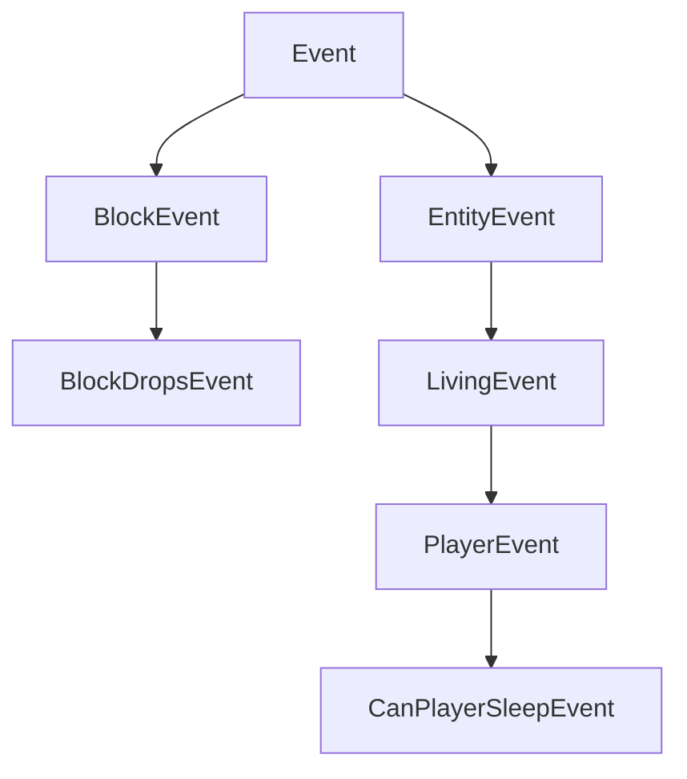

# 事件机制（Events）

NeoForge 的主要功能之一是事件系统。游戏中发生各种事情时都会触发事件。例如，玩家右键点击、玩家或其他 Entity 跳跃、Block 渲染、游戏加载等情况都有对应的事件。模组开发者可以为这些事件订阅事件处理器，然后在处理器内执行所需行为。

事件会在各自对应的事件总线上触发。最重要的是 `NeoForge.EVENT_BUS`，也称为**游戏事件总线**。除此之外，在启动期间，每个已加载的模组都会生成一个模组事件总线，并将其传入模组的 constructor。许多模组事件总线上的事件会并行触发（相比之下，游戏事件总线上的事件始终在同一线程运行），从而显著提升启动速度。详情参见[下文][modbus]。

## 注册事件处理器

注册事件处理器有多种方式。所有方式的共同点是：每个事件处理器都是一个只有单个事件参数且无结果（即返回类型为 `void`）的方法。

### `IEventBus#addListener`

注册方法 handler 最简单的方式是注册其方法引用，如下所示：

```java
@Mod("yourmodid")
public class YourMod {
    public YourMod(IEventBus modBus) {
        NeoForge.EVENT_BUS.addListener(YourMod::onLivingJump);
    }

    // Heals an entity by half a heart every time they jump.
    private static void onLivingJump(LivingEvent.LivingJumpEvent event) {
        LivingEntity entity = event.getEntity();
        // Only heal on the server side
        if (!entity.level().isClientSide()) {
            entity.heal(1);
        }
    }
}
```

### `@SubscribeEvent`

作为替代方案，也可以通过 annotation 驱动事件处理器：创建事件处理器方法并使用 `@SubscribeEvent` 标注。随后，将包含该方法的 class 实例传给事件总线，即可注册该实例中所有使用 `@SubscribeEvent` 标注的事件处理器：

```java
public class EventHandler {
    @SubscribeEvent
    public void onLivingJump(LivingEvent.LivingJumpEvent event) {
        LivingEntity entity = event.getEntity();
        if (!entity.level().isClientSide()) {
            entity.heal(1);
        }
    }
}

@Mod("yourmodid")
public class YourMod {
    public YourMod(IEventBus modBus) {
        NeoForge.EVENT_BUS.register(new EventHandler());
    }
}
```

也可以采用 static 方式。只需将所有事件处理器声明为 static，并传入 class 本身而非 class 实例：

```java
public class EventHandler {
 @SubscribeEvent
    public static void onLivingJump(LivingEvent.LivingJumpEvent event) {
        LivingEntity entity = event.getEntity();
        if (!entity.level().isClientSide()) {
            entity.heal(1);
        }
    }
}

@Mod("yourmodid")
public class YourMod {
    public YourMod(IEventBus modBus) {
        NeoForge.EVENT_BUS.register(EventHandler.class);
    }
}
```

### `@EventBusSubscriber`

还可以更进一步，在事件处理器类上同时添加 `@EventBusSubscriber`。NeoForge 会自动发现这个 annotation，因此可以从 mod constructor 中移除所有事件相关代码。实质上，这等价于在 mod constructor 末尾调用 `NeoForge.EVENT_BUS.register(EventHandler.class)` 和 `modBus.register(EventHandler.class)`。这也意味着所有事件处理器都必须是 static。

虽然不是强制要求，但强烈建议在 annotation 中指定 `modid` 参数，以便更容易调试（特别是在发生模组冲突时）。

```java
@EventBusSubscriber(modid = "yourmodid")
public class EventHandler {
    @SubscribeEvent
    public static void onLivingJump(LivingEvent.LivingJumpEvent event) {
        LivingEntity entity = event.getEntity();
        if (!entity.level().isClientSide()) {
            entity.heal(1);
        }
    }
}
```

## 事件选项

### Field 与方法

Field 与方法可能是事件中最直观的部分。大多数事件都包含供事件处理器使用的上下文，例如导致事件的 Entity，或事件所发生的 Level。

### 层次结构

为了利用继承的优势，有些事件并不直接扩展 `Event`，而是扩展其某个 subclass，例如 `BlockEvent`（为 Block 相关事件提供 Block 上下文）或 `EntityEvent`（类似地提供 Entity 上下文），以及后者的 subclass `LivingEvent`（提供 `LivingEntity` 特定上下文）和 `PlayerEvent`（提供 `Player` 特定上下文）。这些负责提供上下文的上层事件是 `abstract` 的，不能被监听。

:::danger
如果监听一个 `abstract` 事件，游戏会崩溃，因为这绝不是你想要的。你应始终改为监听它的某个子事件。
:::



### 可取消事件

有些事件实现了 `ICancellableEvent` interface。可以使用 `#setCanceled(boolean canceled)` 取消这些事件，也可以使用 `#isCanceled()` 检查取消状态。如果某个事件被取消，该事件的其他事件处理器将不会运行，并会启用与“取消”相关联的某种行为。例如，取消 `LivingChangeTargetEvent` 会阻止 Entity 的目标 Entity 发生变化。

事件处理器可以选择明确接收已取消的事件。具体做法是将 `IEventBus#addListener`（或 `@SubscribeEvent`，取决于你挂接事件处理器的方式）中的 `receiveCanceled` boolean 参数设置为 true。

### TriState 与 Result

有些事件有三种可能的返回状态，它们由 `TriState` 表示，或由事件类上直接定义的 `Result` enum 表示。返回状态通常可以取消事件所处理的动作（`TriState#FALSE`）、强制运行动作（`TriState#TRUE`），或执行默认 Vanilla 行为（`TriState#DEFAULT`）。

具有三种可能返回状态的事件会提供某个 `set*` 方法，用于设置期望结果。

```java
// In some event handler class

@SubscribeEvent // on the game event bus
public static void renderNameTag(RenderNameTagEvent.CanRender event) {
    // Uses TriState to set the return state
    event.setCanRender(TriState.FALSE);
}

@SubscribeEvent // on the game event bus
public static void mobDespawn(MobDespawnEvent event) {
    // Uses a Result enum to set the return state
    event.setResult(MobDespawnEvent.Result.DENY);
}
```

### 优先级

可以选择为事件处理器分配优先级。`EventPriority` enum 包含五个值：`HIGHEST`、`HIGH`、`NORMAL`（默认）、`LOW` 和 `LOWEST`。事件处理器按优先级从高到低执行。如果优先级相同，在游戏事件总线上按注册顺序触发（该顺序大致与模组加载顺序相关），在模组事件总线上则严格按模组加载顺序触发（见下文）。

根据挂接事件处理器的方式，可以通过设置 `IEventBus#addListener` 或 `@SubscribeEvent` 中的 `priority` 参数来定义优先级。注意，对于并行触发的事件，优先级会被忽略。

### 特定端事件

有些事件只在某个[端][side]触发。常见示例包括各种渲染事件，它们只在客户端触发。由于仅客户端事件通常需要访问 Minecraft 代码库中其他仅客户端部分，因此必须按相应方式注册。

使用 `IEventBus#addListener` 的事件处理器应通过 `FMLEnvironment#getDist` 或主 mod constructor 中的 `Dist` 参数检查当前物理端，并按照[端][side]一文所述，在独立的仅客户端 class 中添加 listener。

使用 `@EventBusSubscriber` 的事件处理器可以把端指定为 annotation 的 `value` 参数，例如 `@EventBusSubscriber(value = Dist.CLIENT, modid = "yourmodid")`。

## 事件总线

大多数事件发布在 `NeoForge.EVENT_BUS` 上，但有些事件会改为发布在模组事件总线上。这些通常称为模组总线事件。通过其 superinterface `IModBusEvent` 可以将模组总线事件与常规事件区分开来。

模组事件总线会作为参数传入 mod constructor，之后你便可以向其订阅模组总线事件。如果使用 `@EventBusSubscriber`，事件会自动订阅到正确的事件总线。

### Mod 生命周期

大多数模组总线事件都属于所谓的生命周期事件。生命周期事件在启动期间、每个模组的生命周期中运行一次。其中许多通过继承 `ParallelDispatchEvent` 并行触发；如果希望其中某个事件的代码在主线程上运行，请使用 `#enqueueWork(Runnable runnable)` 将其加入队列。

生命周期通常遵循以下顺序：

- 调用 mod constructor。在这里注册事件处理器，或在下一步注册。
- 调用所有 `@EventBusSubscriber`。
- 触发 `FMLConstructModEvent`。
- 触发 registry 事件，其中包括 [`NewRegistryEvent`][newregistry]、[`DataPackRegistryEvent.NewRegistry`][newdatapackregistry]，以及各个 registry 对应的 [`RegisterEvent`][registerevent]。
- 触发 `FMLCommonSetupEvent`。各种杂项设置在这里进行。
- 触发[特定端][side]设置：物理客户端上为 `FMLClientSetupEvent`，物理服务端上为 `FMLDedicatedServerSetupEvent`。
- 处理 `InterModComms`（见下文）。
- 触发 `FMLLoadCompleteEvent`。

#### `InterModComms`

`InterModComms` 是一个允许模组开发者向其他模组发送消息、以实现兼容性功能的系统。该 class 保存发给各模组的消息，其所有方法都可安全地从多线程调用。该系统主要由两个事件驱动：`InterModEnqueueEvent` 与 `InterModProcessEvent`。

在 `InterModEnqueueEvent` 期间，可以使用 `InterModComms#sendTo` 向其他模组发送消息。这些方法接受消息接收模组的 id、与消息数据关联的 key（用于区分不同消息），以及持有消息数据的 `Supplier`。还可以选择指定发送者。

随后，在 `InterModProcessEvent` 期间，可以使用 `InterModComms#getMessages` 获取由 `IMCMessage` 对象组成的、包含所有已接收消息的 stream。这些对象保存数据发送者、预期接收者、数据 key，以及实际数据的 supplier。

### 其他模组总线事件

除生命周期事件外，还有少数杂项事件会在模组事件总线上触发，这主要是出于历史原因。通常可在这些事件中注册、设置或初始化各种内容。与生命周期事件不同，这些事件大多不会并行运行。示例如下：

- `RegisterColorHandlersEvent.BlockTintSources`、`.ItemTintSources`、`.ColorResolvers`
- `ModelEvent.BakingCompleted`
- `TextureAtlasStitchedEvent`

:::warning
计划在未来版本中将这些事件大多迁移到游戏事件总线。
:::

[modbus]: #事件总线
[newdatapackregistry]: registries.md#custom-datapack-registries
[newregistry]: registries.md#custom-registries
[registerevent]: registries.md#registerevent
[side]: sides.md
