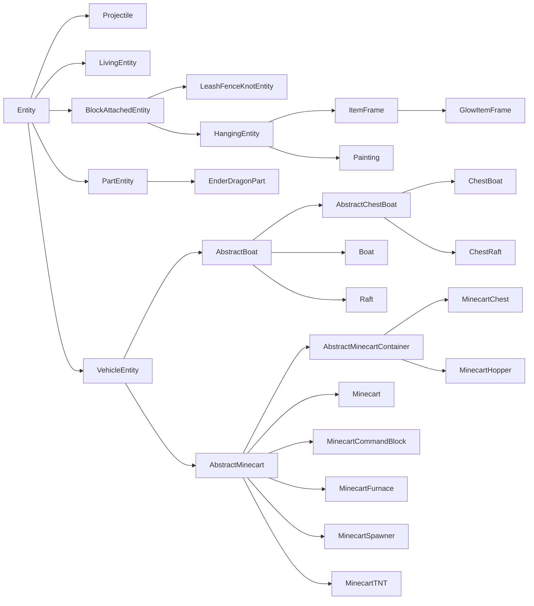
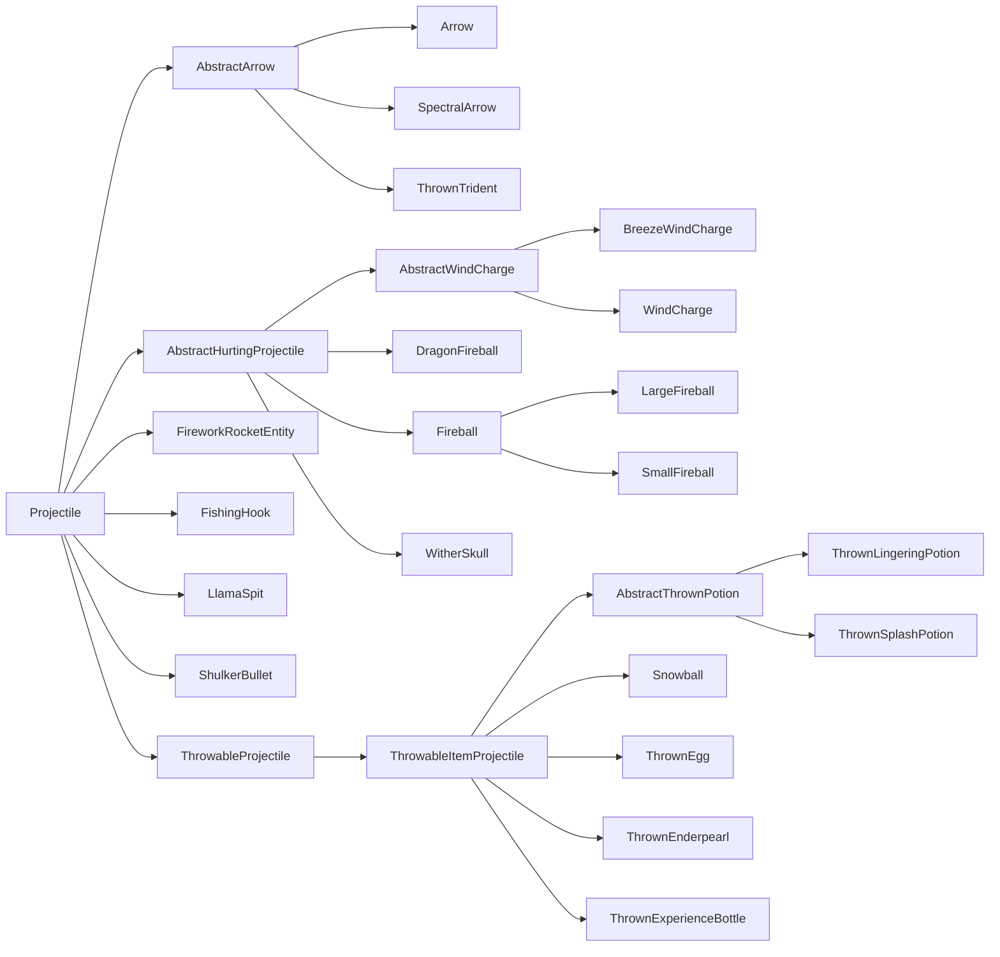

# Entity

Entity 是可通过多种方式与世界交互的世界内对象。常见示例包括 Mob、Projectile、可骑乘对象，甚至玩家。每个 Entity 都由多个系统构成，乍看之下可能难以理解。本节将拆解与构造 Entity 并使其按模组开发者意图行动有关的一些关键组成部分。

## 术语

一个简单 Entity 由三部分构成：

- [`Entity`][entity] subclass，保存 Entity 的大部分逻辑
- [`EntityType`][type]，它会被[注册][registration]并保存一些通用 property
- [`EntityRenderer`][renderer]，负责在游戏中显示 Entity

更复杂的 Entity 可能需要更多部分。例如，许多更复杂的 `EntityRenderer` 会使用底层 `EntityModel` 实例。自然生成的 Entity 则需要某种[生成机制][spawning]。

## `EntityType`

`EntityType` 与 `Entity` 的关系类似 [`Item`][item] 与 [`ItemStack`][itemstack]。与 `Item` 一样，`EntityType` 是注册到相应 registry（Entity type registry）的单例，并保存该类型所有 Entity 共用的一些值；而 `Entity` 与 `ItemStack` 一样，是该单例类型的“实例”，保存特定 Entity 实例的数据。不过这里的关键区别是，大多数行为并非定义在单例 `EntityType` 中，而是定义在实例化的 `Entity` class 本身。

下面创建 `EntityType` registry，并为其注册 `EntityType`；假设已有扩展 `Entity` 的 `MyEntity` class（更多信息见[下文][entity]）。除最后的 `#build` 调用外，`EntityType.Builder` 上的所有方法均为可选。

```java
public static final DeferredRegister.Entities ENTITY_TYPES =
    DeferredRegister.createEntities(ExampleMod.MOD_ID);

public static final Supplier<EntityType<MyEntity>> MY_ENTITY = ENTITY_TYPES.register(
    "my_entity",
    // The entity type, created using a builder.
    () -> EntityType.Builder.of(
        // An EntityType.EntityFactory<T>, where T is the entity class used - MyEntity in this case.
        // You can think of it as a BiFunction<EntityType<T>, Level, T>.
        // This is commonly a reference to the entity constructor.
        MyEntity::new,
        // The MobCategory our entity uses. This is mainly relevant for spawning.
        // See below for more information.
        MobCategory.MISC
    )
    // The width and height, in blocks. The width is used in both horizontal directions.
    // This also means that non-square footprints are not supported. Default is 0.6f and 1.8f.
    .sized(1.0f, 1.0f)
    // A multiplicative factor (scalar) used by mobs that spawn in varying sizes.
    // In vanilla, these are only slimes and magma cubes, both of which use 4.0f.
    .spawnDimensionsScale(4.0f)
    // The eye height, in blocks from the bottom of the size. Defaults to height * 0.85.
    // This must be called after #sized to have an effect.
    .eyeHeight(0.5f)
    // Disables the entity being summonable via /summon.
    .noSummon()
    // Prevents the entity from being saved to disk.
    .noSave()
    // Makes the entity fire immune.
    .fireImmune()
    // Makes the entity immune to damage from a certain block. Vanilla uses this to make
    // foxes immune to sweet berry bushes, withers and wither skeletons immune to wither roses,
    // and polar bears, snow golems and strays immune to powder snow.
    .immuneTo(Blocks.POWDER_SNOW)
    // Disables a rule in the spawn handler that limits the distance at which entities can spawn.
    // This means that no matter the distance to the player, this entity can spawn.
    // Vanilla enables this for pillagers and shulkers.
    .canSpawnFarFromPlayer()
    // The range in which the entity is kept loaded by the client, in chunks.
    // Vanilla values for this vary, but it's often something around 8 or 10. Defaults to 5.
    // Be aware that if this is greater than the client's chunk view distance,
    // then that chunk view distance is effectively used here instead.
    .clientTrackingRange(8)
    // How often update packets are sent for this entity, in once every x ticks. This is set to higher values
    // for entities that have predictable movement patterns, for example projectiles. Defaults to 3.
    .updateInterval(10)
    // Build the entity type using a resource key. The second parameter should be the same as the entity id.
    .build(ResourceKey.create(
        Registries.ENTITY_TYPE,
        Identifier.fromNamespaceAndPath("examplemod", "my_entity")
    ))
);

// Shorthand version to avoid boilerplate. The following call is the same as
// ENTITY_TYPES.register("my_entity", () -> EntityType.Builder.of(MyEntity::new, MobCategory.MISC).build(
//     ResourceKey.create(Registries.ENTITY_TYPE, Identifier.fromNamespaceAndPath("examplemod", "my_entity"))
// );
public static final Supplier<EntityType<MyEntity>> MY_ENTITY =
    ENTITY_TYPES.registerEntityType("my_entity", MyEntity::new, MobCategory.MISC);

// Shorthand version that still allows calling additional builder methods
// by supplying a UnaryOperator<EntityType.Builder> parameter.
public static final Supplier<EntityType<MyEntity>> MY_ENTITY = ENTITY_TYPES.registerEntityType(
    "my_entity", MyEntity::new, MobCategory.MISC,
    builder -> builder.sized(2.0f, 2.0f).eyeHeight(1.5f).updateInterval(5));
```

### `MobCategory`

_另请参阅[自然生成][mobspawn]。_

Entity 的 `MobCategory` 决定该 Entity 与[生成及消失][mobspawn]有关的一些 property。Vanilla 默认共添加八种 `MobCategory`：

| 名称                         | 生成上限 | 示例                                                                                                                           |
|------------------------------|----------|--------------------------------------------------------------------------------------------------------------------------------|
| `MONSTER`                    | 70       | 各种怪物                                                                                                                       |
| `CREATURE`                   | 10       | 各种动物                                                                                                                       |
| `AMBIENT`                    | 15       | 蝙蝠                                                                                                                           |
| `AXOLOTS`                    | 5        | 美西螈                                                                                                                         |
| `UNDERGROUND_WATER_CREATURE` | 5        | 发光鱿鱼                                                                                                                       |
| `WATER_CREATURE`             | 5        | 鱿鱼、海豚                                                                                                                     |
| `WATER_AMBIENT`              | 20       | 鱼                                                                                                                             |
| `MISC`                       | 不适用   | 所有非 LivingEntity，例如 Projectile；使用此 `MobCategory` 会使 Entity 完全无法自然生成                                      |

还有一些其他 property，各自只会在一两种 `MobCategory` 上设置：

- `isFriendly`：`MONSTER` 设为 false，其余均为 true。
- `isPersistent`：`CREATURE` 与 `MISC` 设为 true，其余均为 false。
- `despawnDistance`：`WATER_AMBIENT` 设为 64，其余均为 128。

:::info
`MobCategory` 是[可扩展 enum][extenum]，因此可以向其添加自定义 entry。如果这样做，还必须为该自定义 `MobCategory` 的 Entity 添加某种生成机制。
:::

## Entity Class

首先创建 `Entity` subclass。除 constructor 外，`Entity`（abstract class）还定义了四个必须实现的方法。为避免本文更加臃肿，前三个将在[数据与网络文章][data]中说明；`#hurtServer` 则在 [Entity 受伤一节][damaging]中说明。

```java
public class MyEntity extends Entity {
    // We inherit this constructor without the bound on the generic wildcard.
    // The bound is needed for registration below, so we add it here.
    public MyEntity(EntityType<? extends MyEntity> type, Level level) {
        super(type, level);
    }

    // See the Data and Networking article for information about these methods.
    @Override
    protected void readAdditionalSaveData(ValueInput input) {}

    @Override
    protected void addAdditionalSaveData(ValueOutput output) {}

    @Override
    protected void defineSynchedData(SynchedEntityData.Builder builder) {}

    @Override
    public boolean hurtServer(ServerLevel level, DamageSource damageSource, float amount) {
        return true;
    }
}
```

:::info
尽管可以直接扩展 `Entity`，但使用它的众多 subclass 之一作为基础通常更合理。更多信息参见 [Entity class 层次结构][hierarchy]。
:::

如有需要（例如通过代码生成 Entity），还可以添加自定义 constructor。它们通常会把 Entity type 硬编码为对已注册对象的引用：

```java
public MyEntity(EntityType<? extends MyEntity> type, Level level, double x, double y, double z) {
    // Delegates to the factory constructor, using the EntityType we registered before.
    this(type, level);
    this.setPos(x, y, z);
}
```

:::warning
自定义 constructor 绝不能恰好有两个参数，否则会与上面的 `(EntityType, Level)` constructor 混淆。
:::

现在，基本上可以随意为 Entity 添加功能。以下小节将展示各种常见 Entity 用例。

### 在 Entity 上存储数据

_参见 [Entity／数据与网络][data]。_

### 渲染 Entity

_参见 [Entity／EntityRenderer][renderer]。_

### 生成 Entity

如果现在启动游戏并进入世界，只有一种生成方法：使用 [`/summon`][summon] 命令（假设未调用 `EntityType.Builder#noSummon`）。

显然，我们希望以其他方式添加 Entity。最简单的方法是使用 `LevelWriter#addFreshEntity`。此方法只接受一个 `Entity` 实例并将其添加到世界：

```java
// In some method that has a level available, only on the server
if (!level.isClientSide()) {
    MyEntity entity = new MyEntity(level, 100.0, 200.0, 300.0);
    level.addFreshEntity(entity);
}
```

也可以调用 `EntityType#spawn`，在生成 [LivingEntity][livingentity] 时尤其推荐，因为它会进行一些额外设置，例如触发生成 [Event][event]。

几乎所有非 LivingEntity 都使用这种方式。显然不应自行生成玩家；`Mob` 有[自己的生成方式][mobspawn]（但也可以通过 `#addFreshEntity` 添加）；Vanilla [Projectile][projectile] 也在 `Projectile` class 中提供 static 生成辅助方法。

### 使 Entity 受伤

_另请参阅[左键点击 Item][leftclick]。_

虽然并非所有 Entity 都有生命值概念，但所有 Entity 都能受到伤害。这不仅用于 Mob 与玩家：想想 ItemEntity（掉落的 Item），它们也会受到火或仙人掌等来源的伤害，在这种情况下通常会被立即删除。

可以调用 `Entity#hurt` 或 `Entity#hurtOrSimulate` 使 Entity 受伤，两者之间的区别见下文。两个方法都接受两个参数：[`DamageSource`][damagesource]，以及以半颗心为单位的 float 伤害值。例如，调用 `entity.hurt(entity.damageSources().wither(), 4.25)` 会造成略高于两颗心的凋零伤害。

反过来，Entity 也可以修改此行为。这并非通过覆盖 `#hurt` 完成，因为它是 final 方法。实际上，有 `#hurtServer` 与 `#hurtClient` 两个方法，分别处理相应端的伤害逻辑。`#hurtClient` 通常用于告诉客户端攻击已成功，即使情况并不总是如此；主要目的是无论如何都播放攻击声音与其他效果。要更改伤害行为，我们主要关注 `#hurtServer`，可按如下方式覆盖：

```java
@Override
// The boolean return value determines whether the entity was actually damaged or not.
public boolean hurtServer(ServerLevel level, DamageSource damageSource, float amount) {
    if (damageSource.is(DamageTypeTags.IS_FIRE)) {
        // This assumes that super#hurtServer() is implemented. Common other ways to do this
        // are to set some field yourself. Vanilla implementations vary greatly across different entities.
        // Notably, living entities usually call #actuallyHurt, which in turn calls #setHealth.
        return super.hurtServer(level, damageSource, amount * 2);
    } else {
        return false;
    }
}
```

这种服务端／客户端分离也是 `Entity#hurt` 与 `Entity#hurtOrSimulate` 的区别：`Entity#hurt` 只在服务端运行（并调用 `Entity#hurtServer`），`Entity#hurtOrSimulate` 则在两个端运行，根据所在端调用 `Entity#hurtServer` 或 `Entity#hurtClient`。

还可以通过 Event 修改不属于你的 Entity（即 Minecraft 或其他模组添加的 Entity）所受伤害。这些 Event 包含大量 `LivingEntity` 特定代码，因此其文档位于 [LivingEntity 文章][livingentity]中的[伤害 Event 一节][damageevents]。

### Entity Tick

你经常会希望 Entity 每个 tick 都执行某些操作（例如移动）。此逻辑分布在多个方法中：

- `#tick`：核心 tick 方法，99% 的情况下都应覆盖它。
    - 默认转发到 `#baseTick`，但几乎每个 subclass 都会覆盖它。
- `#baseTick`：处理所有 Entity 共用的一些值的更新，包括“着火”状态、细雪冻结、游泳状态，以及穿过传送门。`LivingEntity` 还会在这里处理溺水、Block 内伤害与伤害 tracker 更新。想更改或补充这些逻辑时，请覆盖此方法。
    - 默认情况下，`Entity#tick` 会转发到此方法。
- `#rideTick`：为其他 Entity 的乘客调用，例如骑马的玩家，或因使用 `/ride` 命令而骑乘其他 Entity 的任意 Entity。
    - 默认进行一些检查，然后调用 `#tick`。骷髅与玩家会覆盖此方法，以特殊处理骑乘 Entity。

此外，Entity 有一个名为 `tickCount` 的 field，表示 Entity 在 Level 中已经存在的 tick 数；还有一个含义应当显而易见的 boolean field `firstTick`。例如，如果想每 5 tick [生成粒子][particle]，可以使用以下代码：

```java
@Override
public void tick() {
    // Always call super unless you have a good reason not to.
    super.tick();
    // Run this code once every 5 ticks.
    if (this.tickCount % 5 == 0) {
        this.level().addParticle(...);
    }
}
```

### 选取 Entity

_另请参阅[中键点击][middleclick]。_

选取是选择玩家当前正在注视的对象，并随后选取关联 Item 的过程。你的 Entity 可以修改中键点击的结果，也就是“选取结果”（请注意，`Mob` class 会代你选择正确的刷怪蛋）：

```java
@Override
@Nullable
public ItemStack getPickResult() {
    // Assumes that MY_CUSTOM_ITEM is a DeferredItem<?>, see the Items article for more information.
    // If the entity should not be pickable, it is advised to return null here.
    return new ItemStack(MY_CUSTOM_ITEM.get());
}
```

通常 Entity 应当可被选取，但少数特殊情况并不适合。Vanilla 中的例子是末影龙，它由多个部分构成。父 Entity 禁用选取，各部分则重新启用，以便更精细地调整 hitbox。

如果有类似的特殊用例，也可以完全禁用 Entity 的选取：

```java
@Override
public boolean isPickable() {
    // Additional checks may be performed here if needed.
    return false;
}
```

如果想自行执行选取（即 ray cast），可以对希望作为 ray cast 起点的 Entity 调用 `Entity#pick`。它会返回 [`HitResult`][hitresult]，可以进一步检查 ray cast 究竟命中了什么。

### Entity Attachment

_不要与[数据附件][dataattachments]混淆。_

Entity attachment 用于定义 Entity 的可视附着点。利用此系统，可以定义乘客或名牌等内容相对于 Entity 本身显示的位置。Entity 本身只控制 attachment 的默认位置，attachment 随后可定义相对于该默认位置的 offset。

构建 `EntityType` 时，可以调用 `EntityType.Builder#attach` 设置任意数量的 attachment point。此方法接受一个 `EntityAttachment`（定义要考虑的 attachment），以及三个定义位置（x/y/z）的 float。位置应相对于该 attachment 默认值所在位置定义。

Vanilla 定义了以下四种 `EntityAttachment`：

| 名称           | 默认位置                                  | 用途                                                                    |
|----------------|-------------------------------------------|-------------------------------------------------------------------------|
| `PASSENGER`    | Hitbox 的 X 中心／Y 顶部／Z 中心         | 马等可骑乘 Entity，用于定义乘客出现的位置                               |
| `VEHICLE`      | Hitbox 的 X 中心／Y 底部／Z 中心         | 所有 Entity，用于定义骑乘其他 Entity 时自身出现的位置                    |
| `NAME_TAG`     | Hitbox 的 X 中心／Y 顶部／Z 中心         | 定义 Entity 名牌出现的位置（如果适用）                                   |
| `WARDEN_CHEST` | Hitbox 的 X 中心／Y 中心／Z 中心         | 监守者使用，用于定义音波攻击的起始位置                                   |

:::info
`PASSENGER` 与 `VEHICLE` 彼此相关，因为它们在同一 context 中使用。首先应用 `PASSENGER` 来定位骑乘者，然后在骑乘者上应用 `VEHICLE`。
:::

每个 attachment 都可理解为从 `EntityAttachment` 到 `List<Vec3>` 的映射。实际使用的 point 数量取决于消费系统。例如，船与骆驼会使用两个 `PASSENGER` point，而马或矿车等 Entity 只使用一个 `PASSENGER` point。

`EntityType.Builder` 还提供一些与 `EntityAttachment` 相关的辅助方法：

- `#passengerAttachment()`：用于定义 `PASSENGER` attachment，有两个变体。
    - 一个变体接受由 attachment point 组成的 `Vec3...`。
    - 另一个变体接受 `float...`，它会把每个 float 转换为以该 float 作为 y 值、x 与 z 均设为 0 的 `Vec3`，再转发给 `Vec3...` 变体。
- `#vehicleAttachment()`：用于定义 `VEHICLE` attachment，接受 `Vec3`。
- `#ridingOffset()`：用于定义 `VEHICLE` attachment。接受 float，并使用 x、z 设为 0，y 设为所传 float 负值的 `Vec3` 转发到 `#vehicleAttachment()`。
- `#nameTagOffset()`：用于定义 `NAME_TAG` attachment。接受一个用作 y 值的 float，x 与 z 则使用 0。

作为替代，也可以调用 `EntityAttachments#builder()`，再对该 builder 调用 `#attach()` 来自行定义 attachment：

```java
// In some EntityType<?> creation
EntityType.Builder.of(...)
    // This EntityAttachment will make name tags float half a block above the ground.
    // If this is not set, it will default to the entity's hitbox height.
    .attach(EntityAttachment.NAME_TAG, 0, 0.5f, 0)
    .build();
```

## Entity Class 层次结构

由于 Entity 类型众多，`Entity` 有复杂的 subclass 层次结构。创建自己的 Entity 时，选择要扩展的 class 需要了解这些内容，因为复用它们的代码可以省去大量工作。

Vanilla Entity 层次结构如下（红色 class 为 `abstract`，蓝色 class 不是）：



下面分别说明：

- `Projectile`：各种 Projectile 的基础 class，包括箭、火球、雪球、烟花及类似 Entity。更多信息参见[下文][projectile]。
- `LivingEntity`：任何“活着”的对象所使用的基础 class，即具有生命值、装备、[MobEffect][mobeffect]及其他一些 property 的对象。包括怪物、动物、村民与玩家等。更多信息参见 [LivingEntity 文章][livingentity]。
- `BlockAttachedEntity`：无法移动且附着于 Block 的 Entity 所使用的基础 class，包括拴绳结、物品展示框与画。其 subclass 主要用于复用通用代码。
- `PartEntity`：NeoForge 添加的复合 Entity 基础 class，即由多个较小 Entity 组成的 Entity。`EnderDragonPart` 经过 patch，会扩展 `PartEntity` 而不是 `Entity`。
- `VehicleEntity`：船与矿车的基础 class。虽然这些 Entity 与 `LivingEntity` 大致共用生命值概念，但不共用许多其他 property，因此彼此分离。其 subclass 主要用于复用通用代码。

还有多个 Entity 是 `Entity` 的直接 subclass，仅仅因为没有其他合适的 superclass。其中大多数应当不言自明：

- `AreaEffectCloud`（滞留药水云）
- `EndCrystal`
- `EvokerFangs`
- `ExperienceOrb`
- `EyeOfEnder`
- `FallingBlockEntity`（下落的沙、沙砾等）
- `ItemEntity`（掉落的 Item）
- `LightningBolt`
- `OminousItemSpawner`（用于持续生成试炼刷怪笼的战利品）
- `PrimedTnt`

此图与列表不包括地图制作者 Entity（display、interaction 与 marker）。

### Projectile

Projectile 是 Entity 的一个子群体。其共同点是沿一个方向飞行直到命中某物，并且会为其指定 owner（例如玩家或骷髅是箭的 owner，恶魂是火球的 owner）。

Projectile 的 class 层次结构如下（红色 class 为 `abstract`，蓝色 class 不是）：



值得注意的是 `Projectile` 的三个直接 abstract subclass：

- `AbstractArrow`：涵盖不同种类的箭，以及三叉戟。一个重要的共同 property 是它们不会直线飞行，而会受到重力影响。
- `AbstractHurtingProjectile`：涵盖风弹、各种火球与凋零之首。它们是不受重力影响、会造成伤害的 Projectile。
- `ThrowableProjectile`：涵盖鸡蛋、雪球与末影珍珠等对象。与箭一样，它们受重力影响；但与箭不同，它们命中目标时不会造成伤害。它们也全都通过使用相应 [Item][item] 生成。

可通过扩展 `Projectile` 或合适的 subclass 创建新 Projectile，然后覆盖添加功能所需的方法。常见的覆盖方法包括：

- `#shoot`：计算并设置 Projectile 的正确速度。
- `#onHit`：命中某物时调用。
    - `#onHitEntity`：命中的是 [Entity][entity] 时调用。
    - `#onHitBlock`：命中的是 [Block][block] 时调用。
- `#getOwner` 与 `#setOwner`，分别用于获取与设置 owner Entity。
- `#deflect`，根据传入的 `ProjectileDeflection` enum 值弹开 Projectile。
- `#onDeflection`，由 `#deflect` 调用，用于任何弹开后的行为。

[block]: ../blocks/index.md
[damageevents]: livingentity.md#damage-events
[damagesource]: ../resources/server/damagetypes.md#creating-and-using-damage-sources
[damaging]: #damaging-entities
[data]: data.md
[dataattachments]: ../datastorage/attachments.md
[entity]: #the-entity-class
[event]: ../concepts/events.md
[extenum]: ../advanced/extensibleenums.md
[hierarchy]: #entity-class-hierarchy
[hitresult]: ../items/interactions.md#hitresults
[item]: ../items/index.md
[itemstack]: ../items/index.md#itemstacks
[leftclick]: ../items/interactions.md#left-clicking-an-item
[livingentity]: livingentity.md
[middleclick]: ../items/interactions.md#middle-clicking
[mobeffect]: ../items/mobeffects.md
[mobspawn]: livingentity.md#spawning
[particle]: ../resources/client/particles.md
[projectile]: #projectiles
[registration]: ../concepts/registries.md#methods-for-registering
[renderer]: renderer.md
[spawning]: #spawning-entities
[summon]: https://minecraft.wiki/w/Commands/summon
[type]: #entitytype
