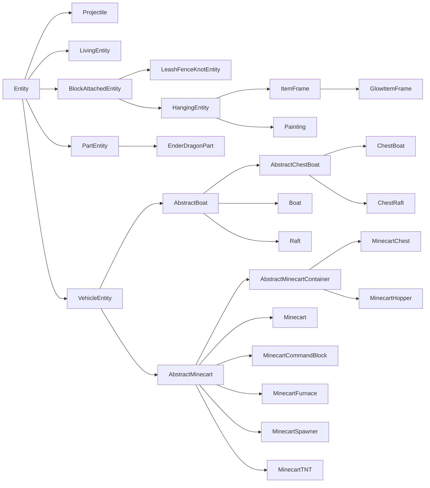
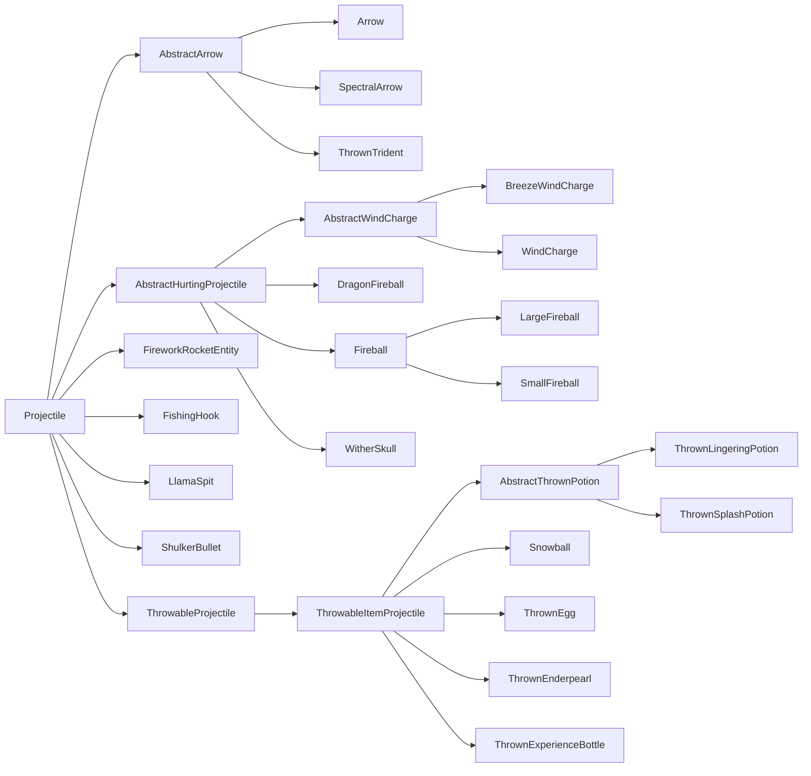

# 实体（Entity）

实体是可通过多种方式与世界交互的世界内对象。常见示例包括生物、抛射物、可骑乘对象，甚至玩家。每个实体都由多个系统构成，乍看之下可能难以理解。本节将拆解与构造实体并使其按模组开发者意图行动有关的一些关键组成部分。

## 术语

一个简单实体由三部分构成：

- [`Entity`][entity] 子类，保存实体的大部分逻辑
- [`EntityType`][type]，它会被[注册][registration]并保存一些通用 property
- [`EntityRenderer`][renderer]，负责在游戏中显示实体

更复杂的实体可能需要更多部分。例如，许多更复杂的 `EntityRenderer` 会使用底层 `EntityModel` 实例。自然生成的实体则需要某种[生成机制][spawning]。

## `EntityType`

`EntityType` 与 `Entity` 的关系类似 [`Item`][item] 与 [`ItemStack`][itemstack]。与 `Item` 一样，`EntityType` 是注册到相应注册表（实体类型注册表）的单例，并保存该类型所有实体共用的一些值；而 `Entity` 与 `ItemStack` 一样，是该单例类型的“实例”，保存特定实体实例的数据。不过这里的关键区别是，大多数行为并非定义在单例 `EntityType` 中，而是定义在实例化的 `Entity` 类本身。

下面创建 `EntityType` 注册表，并为其注册 `EntityType`；假设已有扩展 `Entity` 的 `MyEntity` 类（更多信息见[下文][entity]）。除最后的 `#build` 调用外，`EntityType.Builder` 上的所有方法均为可选。

```java
public static final DeferredRegister.Entities ENTITY_TYPES =
    DeferredRegister.createEntities(ExampleMod.MOD_ID);

public static final Supplier<EntityType<MyEntity>> MY_ENTITY = ENTITY_TYPES.register(
    "my_entity",
    // 使用 builder 创建的实体类型。
    () -> EntityType.Builder.of(
        // 一个 EntityType.EntityFactory<T>，其中 T 是所用的实体类——本例为 MyEntity。
        // 可以将其视为 BiFunction<EntityType<T>, Level, T>。
        // 这通常是对实体构造器的引用。
        MyEntity::new,
        // 我们实体使用的 MobCategory。这主要与产卵有关。
        // 请参阅下文了解更多信息。
        MobCategory.MISC
    )
    // 宽度和高度，以方块为单位。宽度用于两个水平方向。
    // 这也意味着不支持非方形封装。默认值为 0.6f 和 1.8f。
    .sized(1.0f, 1.0f)
    // 乘法 factor（标量），用于生成不同大小的生物。
    // 在原版中，这些只是史莱姆和岩浆立方体，两者都使用 4.0f。
    .spawnDimensionsScale(4.0f)
    // 眼高，以距底部尺寸的方块为单位。默认为高度 * 0.85。
    // 必须在 #sized之后调用才能生效。
    .eyeHeight(0.5f)
    // 禁用通过 /summon 召唤的实体。
    .noSummon()
    // 防止实体保存到磁盘。
    .noSave()
    // 使实体免疫火焰。
    .fireImmune()
    // 使实体免受特定方块的伤害。 原版使用此来制作
    // 狐狸对甜浆果灌木免疫，凋灵和凋灵骷髅对凋零玫瑰免疫，
    // 和北极熊、雪傀儡和流浪动物对粉雪免疫。
    .immuneTo(Blocks.POWDER_SNOW)
    // 禁用生成处理器中限制实体生成距离的规则。
    // 这意味着无论与玩家的距离如何，此实体都可以生成。
    // 原版为掠夺者和潜影贝启用此。
    .canSpawnFarFromPlayer()
    // 客户端保持加载实体的范围（以区块为单位）。
    // 其原版值有所不同，但通常约为 8 或 10。默认为 5。
    // 请注意，如果此大于客户端的区块视图距离，
    // 那么该区块视图距离在这里被有效地使用。
    .clientTrackingRange(8)
    // 为此实体发送更新数据包的频率，每 x 个周期一次。这被设置为更高的值
    // 适用于具有可预测运动模式的实体，例如射弹。默认为 3。
    .updateInterval(10)
    // 使用资源键构建实体类型。第二个参数应该与实体ID相同。
    .build(ResourceKey.create(
        Registries.ENTITY_TYPE,
        Identifier.fromNamespaceAndPath("examplemod", "my_entity")
    ))
);

// 速记版本以避免样板。以下调用与以下相同
// ENTITY_TYPES.register("my_entity", () -> EntityType.Builder.of(MyEntity::new, MobCategory.MISC).build(
//     ResourceKey.create(Registries.ENTITY_TYPE, Identifier.fromNamespaceAndPath("examplemod", "my_entity"))
// );
public static final Supplier<EntityType<MyEntity>> MY_ENTITY =
    ENTITY_TYPES.registerEntityType("my_entity", MyEntity::new, MobCategory.MISC);

// 仍允许调用其他 builder 方法的简写版本
// 方式是提供一个 UnaryOperator<EntityType.Builder> 参数。
public static final Supplier<EntityType<MyEntity>> MY_ENTITY = ENTITY_TYPES.registerEntityType(
    "my_entity", MyEntity::new, MobCategory.MISC,
    builder -> builder.sized(2.0f, 2.0f).eyeHeight(1.5f).updateInterval(5));
```

### `MobCategory`

_另请参阅[自然生成][mobspawn]。_

实体的 `MobCategory` 决定该实体与[生成及消失][mobspawn]有关的一些 property。原版默认共添加八种 `MobCategory`：

| 名称                         | 生成上限 | 示例                                                                                                                           |
|------------------------------|----------|--------------------------------------------------------------------------------------------------------------------------------|
| `MONSTER`                    | 70       | 各种怪物                                                                                                                       |
| `CREATURE`                   | 10       | 各种动物                                                                                                                       |
| `AMBIENT`                    | 15       | 蝙蝠                                                                                                                           |
| `AXOLOTS`                    | 5        | 美西螈                                                                                                                         |
| `UNDERGROUND_WATER_CREATURE` | 5        | 发光鱿鱼                                                                                                                       |
| `WATER_CREATURE`             | 5        | 鱿鱼、海豚                                                                                                                     |
| `WATER_AMBIENT`              | 20       | 鱼                                                                                                                             |
| `MISC`                       | 不适用   | 所有非生命实体，例如抛射物；使用此 `MobCategory` 会使实体完全无法自然生成                                      |

还有一些其他 property，各自只会在一两种 `MobCategory` 上设置：

- `isFriendly`：`MONSTER` 设为 false，其余均为 true。
- `isPersistent`：`CREATURE` 与 `MISC` 设为 true，其余均为 false。
- `despawnDistance`：`WATER_AMBIENT` 设为 64，其余均为 128。

:::info
`MobCategory` 是[可扩展枚举][extenum]，因此可以向其添加自定义 entry。如果这样做，还必须为该自定义 `MobCategory` 的实体添加某种生成机制。
:::

## 实体类

首先创建 `Entity` 子类。除构造器外，`Entity`（抽象类）还定义了四个必须实现的方法。为避免本文更加臃肿，前三个将在[数据与网络文章][data]中说明；`#hurtServer` 则在 [实体受伤一节][damaging]中说明。

```java
public class MyEntity extends Entity {
    // 我们继承了此构造器，没有泛型通配符的绑定。
    // 下面注册需要绑定，所以在这里添加。
    public MyEntity(EntityType<? extends MyEntity> type, Level level) {
        super(type, level);
    }

    // 有关这些方法的信息，请参阅数据和网络文章。
    @Override
    protected void readAdditionalSaveData(ValueInput input) {}

    @Override
    protected void addAdditionalSaveData(ValueOutput output) {}

    @Override
    protected void defineSynchedData(SynchedEntityData.Builder builder) {}

    @Override
    public boolean hurtServer(ServerLevel level, DamageSource damageSource, float amount) {
        return true;
    }
}
```

:::info
尽管可以直接扩展 `Entity`，但使用它的众多子类之一作为基础通常更合理。更多信息参见 [实体类层次结构][hierarchy]。
:::

如有需要（例如通过代码生成实体），还可以添加自定义构造器。它们通常会把实体类型硬编码为对已注册对象的引用：

```java
public MyEntity(EntityType<? extends MyEntity> type, Level level, double x, double y, double z) {
    // 委托给工厂构造器，使用我们之前注册的EntityType。
    this(type, level);
    this.setPos(x, y, z);
}
```

:::warning
自定义构造器绝不能恰好有两个参数，否则会与上面的 `(EntityType, Level)` 构造器混淆。
:::

现在，基本上可以随意为实体添加功能。以下小节将展示各种常见实体用例。

### 在实体上存储数据

_参见 [实体／数据与网络][data]。_

### 渲染实体

_参见 [实体／实体渲染器][renderer]。_

### 生成实体

如果现在启动游戏并进入世界，只有一种生成方法：使用 [`/summon`][summon] 命令（假设未调用 `EntityType.Builder#noSummon`）。

显然，我们希望以其他方式添加实体。最简单的方法是使用 `LevelWriter#addFreshEntity`。此方法只接受一个 `Entity` 实例并将其添加到世界：

```java
// 在某些具有可用级别的方法中，仅在服务器上
if (!level.isClientSide()) {
    MyEntity entity = new MyEntity(level, 100.0, 200.0, 300.0);
    level.addFreshEntity(entity);
}
```

也可以调用 `EntityType#spawn`，在生成 [生命实体][livingentity] 时尤其推荐，因为它会进行一些额外设置，例如触发生成 [事件][event]。

几乎所有非生命实体都使用这种方式。显然不应自行生成玩家；`Mob` 有[自己的生成方式][mobspawn]（但也可以通过 `#addFreshEntity` 添加）；原版 [抛射物][projectile] 也在 `Projectile` 类中提供静态生成辅助方法。

### 使实体受伤

_另请参阅[左键点击物品][leftclick]。_

虽然并非所有实体都有生命值概念，但所有实体都能受到伤害。这不仅用于生物与玩家：想想物品实体（掉落的物品），它们也会受到火或仙人掌等来源的伤害，在这种情况下通常会被立即删除。

可以调用 `Entity#hurt` 或 `Entity#hurtOrSimulate` 使实体受伤，两者之间的区别见下文。两个方法都接受两个参数：[`DamageSource`][damagesource]，以及以半颗心为单位的 float 伤害值。例如，调用 `entity.hurt(entity.damageSources().wither(), 4.25)` 会造成略高于两颗心的凋零伤害。

反过来，实体也可以修改此行为。这并非通过覆盖 `#hurt` 完成，因为它是 `final` 方法。实际上，有 `#hurtServer` 与 `#hurtClient` 两个方法，分别处理相应端的伤害逻辑。`#hurtClient` 通常用于告诉客户端攻击已成功，即使情况并不总是如此；主要目的是无论如何都播放攻击声音与其他效果。要更改伤害行为，我们主要关注 `#hurtServer`，可按如下方式覆盖：

```java
@Override
// boolean 返回值确定实体是否实际伤害。
public boolean hurtServer(ServerLevel level, DamageSource damageSource, float amount) {
    if (damageSource.is(DamageTypeTags.IS_FIRE)) {
        // 这假设实现了 super#hurtServer()。常见其他方式做此
        // 是自己设置一些字段。不同实体的普通实现差异很大。
        // 值得注意的是，生物体通常调用 #actuallyHurt，而 #actuallyHurt又调用 #setHealth。
        return super.hurtServer(level, damageSource, amount * 2);
    } else {
        return false;
    }
}
```

这种服务端／客户端分离也是 `Entity#hurt` 与 `Entity#hurtOrSimulate` 的区别：`Entity#hurt` 只在服务端运行（并调用 `Entity#hurtServer`），`Entity#hurtOrSimulate` 则在两个端运行，根据所在端调用 `Entity#hurtServer` 或 `Entity#hurtClient`。

还可以通过事件修改不属于你的实体（即 Minecraft 或其他模组添加的实体）所受伤害。这些事件包含大量 `LivingEntity` 特定代码，因此其文档位于 [生命实体文章][livingentity]中的[伤害事件一节][damageevents]。

### 实体 Tick

你经常会希望实体每个 tick 都执行某些操作（例如移动）。此逻辑分布在多个方法中：

- `#tick`：核心 tick 方法，99% 的情况下都应覆盖它。
    - 默认转发到 `#baseTick`，但几乎每个子类都会覆盖它。
- `#baseTick`：处理所有实体共用的一些值的更新，包括“着火”状态、细雪冻结、游泳状态，以及穿过传送门。`LivingEntity` 还会在这里处理溺水、方块内伤害与伤害追踪器更新。想更改或补充这些逻辑时，请覆盖此方法。
    - 默认情况下，`Entity#tick` 会转发到此方法。
- `#rideTick`：为其他实体的乘客调用，例如骑马的玩家，或因使用 `/ride` 命令而骑乘其他实体的任意实体。
    - 默认进行一些检查，然后调用 `#tick`。骷髅与玩家会覆盖此方法，以特殊处理骑乘实体。

此外，实体有一个名为 `tickCount` 的字段，表示实体在 `Level` 中已经存在的 tick 数；还有一个含义应当显而易见的 boolean 字段 `firstTick`。例如，如果想每 5 tick [生成粒子][particle]，可以使用以下代码：

```java
@Override
public void tick() {
    // 始终致电 super，除非你有充分的理由不这样做。
    super.tick();
    // 每 5 个周期运行一次此代码。
    if (this.tickCount % 5 == 0) {
        this.level().addParticle(...);
    }
}
```

### 选取实体

_另请参阅[中键点击][middleclick]。_

选取是选择玩家当前正在注视的对象，并随后选取关联物品的过程。你的实体可以修改中键点击的结果，也就是“选取结果”（请注意，`Mob` 类会代你选择正确的刷怪蛋）：

```java
@Override
@Nullable
public ItemStack getPickResult() {
    // 假设 MY_CUSTOM_ITEM 是 DeferredItem<?>，有关详细信息，请参阅 Items 文章。
    // 如果实体不可选取，建议此处为返回 null。
    return new ItemStack(MY_CUSTOM_ITEM.get());
}
```

通常实体应当可被选取，但少数特殊情况并不适合。原版中的例子是末影龙，它由多个部分构成。父实体禁用选取，各部分则重新启用，以便更精细地调整碰撞箱。

如果有类似的特殊用例，也可以完全禁用实体的选取：

```java
@Override
public boolean isPickable() {
    // 如果需要，可以在此处执行附加检查。
    return false;
}
```

如果想自行执行选取（即光线投射），可以对希望作为光线投射起点的实体调用 `Entity#pick`。它会返回 [`HitResult`][hitresult]，可以进一步检查光线投射究竟命中了什么。

### 实体附件（Entity Attachment）

_不要与[数据附件][dataattachments]混淆。_

实体附件用于定义实体的可视附着点。利用此系统，可以定义乘客或名牌等内容相对于实体本身显示的位置。实体本身只控制附件的默认位置，附件随后可定义相对于该默认位置的偏移。

构建 `EntityType` 时，可以调用 `EntityType.Builder#attach` 设置任意数量的附件点。此方法接受一个 `EntityAttachment`（定义要考虑的附件），以及三个定义位置（x/y/z）的 float。位置应相对于该附件默认值所在位置定义。

原版定义了以下四种 `EntityAttachment`：

| 名称           | 默认位置                                  | 用途                                                                    |
|----------------|-------------------------------------------|-------------------------------------------------------------------------|
| `PASSENGER`    | 碰撞箱的 X 中心／Y 顶部／Z 中心         | 马等可骑乘实体，用于定义乘客出现的位置                               |
| `VEHICLE`      | 碰撞箱的 X 中心／Y 底部／Z 中心         | 所有实体，用于定义骑乘其他实体时自身出现的位置                    |
| `NAME_TAG`     | 碰撞箱的 X 中心／Y 顶部／Z 中心         | 定义实体名牌出现的位置（如果适用）                                   |
| `WARDEN_CHEST` | 碰撞箱的 X 中心／Y 中心／Z 中心         | 监守者使用，用于定义音波攻击的起始位置                                   |

:::info
`PASSENGER` 与 `VEHICLE` 彼此相关，因为它们在同一上下文中使用。首先应用 `PASSENGER` 来定位骑乘者，然后在骑乘者上应用 `VEHICLE`。
:::

每个附件都可理解为从 `EntityAttachment` 到 `List<Vec3>` 的映射。实际使用的点数量取决于消费系统。例如，船与骆驼会使用两个 `PASSENGER` 点，而马或矿车等实体只使用一个 `PASSENGER` 点。

`EntityType.Builder` 还提供一些与 `EntityAttachment` 相关的辅助方法：

- `#passengerAttachment()`：用于定义 `PASSENGER` 附件，有两个变体。
    - 一个变体接受由附件点组成的 `Vec3...`。
    - 另一个变体接受 `float...`，它会把每个 float 转换为以该 float 作为 y 值、x 与 z 均设为 0 的 `Vec3`，再转发给 `Vec3...` 变体。
- `#vehicleAttachment()`：用于定义 `VEHICLE` 附件，接受 `Vec3`。
- `#ridingOffset()`：用于定义 `VEHICLE` 附件。接受 float，并使用 x、z 设为 0，y 设为所传 float 负值的 `Vec3` 转发到 `#vehicleAttachment()`。
- `#nameTagOffset()`：用于定义 `NAME_TAG` 附件。接受一个用作 y 值的 float，x 与 z 则使用 0。

作为替代，也可以调用 `EntityAttachments#builder()`，再对该 builder 调用 `#attach()` 来自行定义附件：

```java
// 在一些 EntityType<?> 创建中
EntityType.Builder.of(...)
    // 这个 EntityAttachment 将使姓名标签 float 距地面半个街区。
    // 如果未设置此，则默认为实体的碰撞箱高度。
    .attach(EntityAttachment.NAME_TAG, 0, 0.5f, 0)
    .build();
```

## 实体类层次结构

由于实体类型众多，`Entity` 有复杂的子类层次结构。创建自己的实体时，选择要扩展的类需要了解这些内容，因为复用它们的代码可以省去大量工作。

原版实体层次结构如下（红色类为 `abstract`，蓝色类不是）：



下面分别说明：

- `Projectile`：各种抛射物的基础类，包括箭、火球、雪球、烟花及类似实体。更多信息参见[下文][projectile]。
- `LivingEntity`：任何“活着”的对象所使用的基础类，即具有生命值、装备、[生物效果][mobeffect]及其他一些 property 的对象。包括怪物、动物、村民与玩家等。更多信息参见 [生命实体文章][livingentity]。
- `BlockAttachedEntity`：无法移动且附着于方块的实体所使用的基础类，包括拴绳结、物品展示框与画。其子类主要用于复用通用代码。
- `PartEntity`：NeoForge 添加的复合实体基础类，即由多个较小实体组成的实体。`EnderDragonPart` 经过 patch，会扩展 `PartEntity` 而不是 `Entity`。
- `VehicleEntity`：船与矿车的基础类。虽然这些实体与 `LivingEntity` 大致共用生命值概念，但不共用许多其他 property，因此彼此分离。其子类主要用于复用通用代码。

还有多个实体是 `Entity` 的直接子类，仅仅因为没有其他合适的超类。其中大多数应当不言自明：

- `AreaEffectCloud`（滞留药水云）
- `EndCrystal`
- `EvokerFangs`
- `ExperienceOrb`
- `EyeOfEnder`
- `FallingBlockEntity`（下落的沙、沙砾等）
- `ItemEntity`（掉落的物品）
- `LightningBolt`
- `OminousItemSpawner`（用于持续生成试炼刷怪笼的战利品）
- `PrimedTnt`

此图与列表不包括地图制作者使用的实体（`display`、`interaction` 与 `marker`）。

### 抛射物（Projectile）

抛射物是实体的一个子群体。其共同点是沿一个方向飞行直到命中某物，并且会为其指定所有者（例如玩家或骷髅是箭的所有者，恶魂是火球的所有者）。

抛射物的类层次结构如下（红色类为 `abstract`，蓝色类不是）：



值得注意的是 `Projectile` 的三个直接抽象子类：

- `AbstractArrow`：涵盖不同种类的箭，以及三叉戟。一个重要的共同 property 是它们不会直线飞行，而会受到重力影响。
- `AbstractHurtingProjectile`：涵盖风弹、各种火球与凋零之首。它们是不受重力影响、会造成伤害的抛射物。
- `ThrowableProjectile`：涵盖鸡蛋、雪球与末影珍珠等对象。与箭一样，它们受重力影响；但与箭不同，它们命中目标时不会造成伤害。它们也全都通过使用相应 [物品][item] 生成。

可通过扩展 `Projectile` 或合适的子类创建新抛射物，然后覆盖添加功能所需的方法。常见的覆盖方法包括：

- `#shoot`：计算并设置抛射物的正确速度。
- `#onHit`：命中某物时调用。
    - `#onHitEntity`：命中的是 [实体][entity] 时调用。
    - `#onHitBlock`：命中的是 [方块][block] 时调用。
- `#getOwner` 与 `#setOwner`，分别用于获取与设置所有者实体。
- `#deflect`，根据传入的 `ProjectileDeflection` 枚举值弹开抛射物。
- `#onDeflection`，由 `#deflect` 调用，用于任何弹开后的行为。

[block]: ../blocks/index.md
[damageevents]: livingentity.md#伤害事件
[damagesource]: ../resources/server/damagetypes.md#创建和使用伤害来源
[damaging]:#使实体受伤
[data]: data.md
[dataattachments]: ../datastorage/attachments.md
[entity]: #实体类
[event]: ../concepts/events.md
[extenum]: ../advanced/extensibleenums.md
[hierarchy]: #实体类层次结构
[hitresult]: ../items/interactions.md#hitresults
[item]: ../items/index.md
[itemstack]: ../items/index.md#itemstacks
[leftclick]: ../items/interactions.md#left-clicking-an-item
[livingentity]: livingentity.md
[middleclick]: ../items/interactions.md#middle-clicking
[mobeffect]: ../items/mobeffects.md
[mobspawn]: livingentity.md#spawning
[particle]: ../resources/client/particles.md
[projectile]: #抛射物projectile
[registration]: ../concepts/registries.md#methods-for-registering
[renderer]: renderer.md
[spawning]: #生成实体
[summon]: https://minecraft.wiki/w/Commands/summon
[type]: #entitytype
