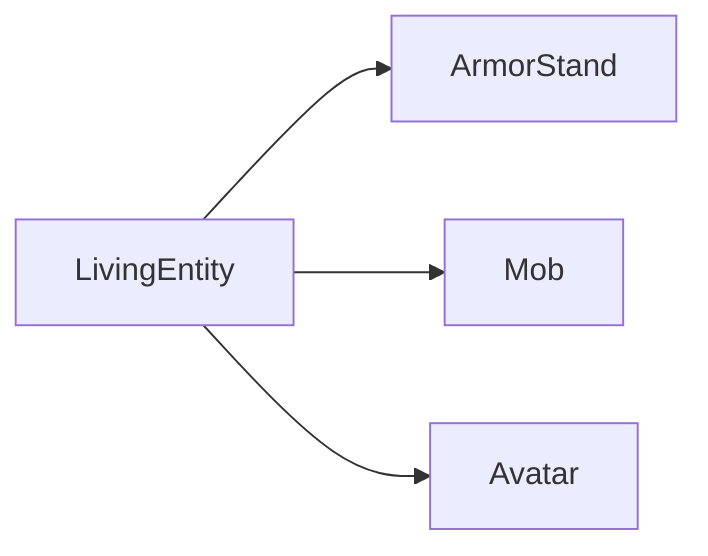
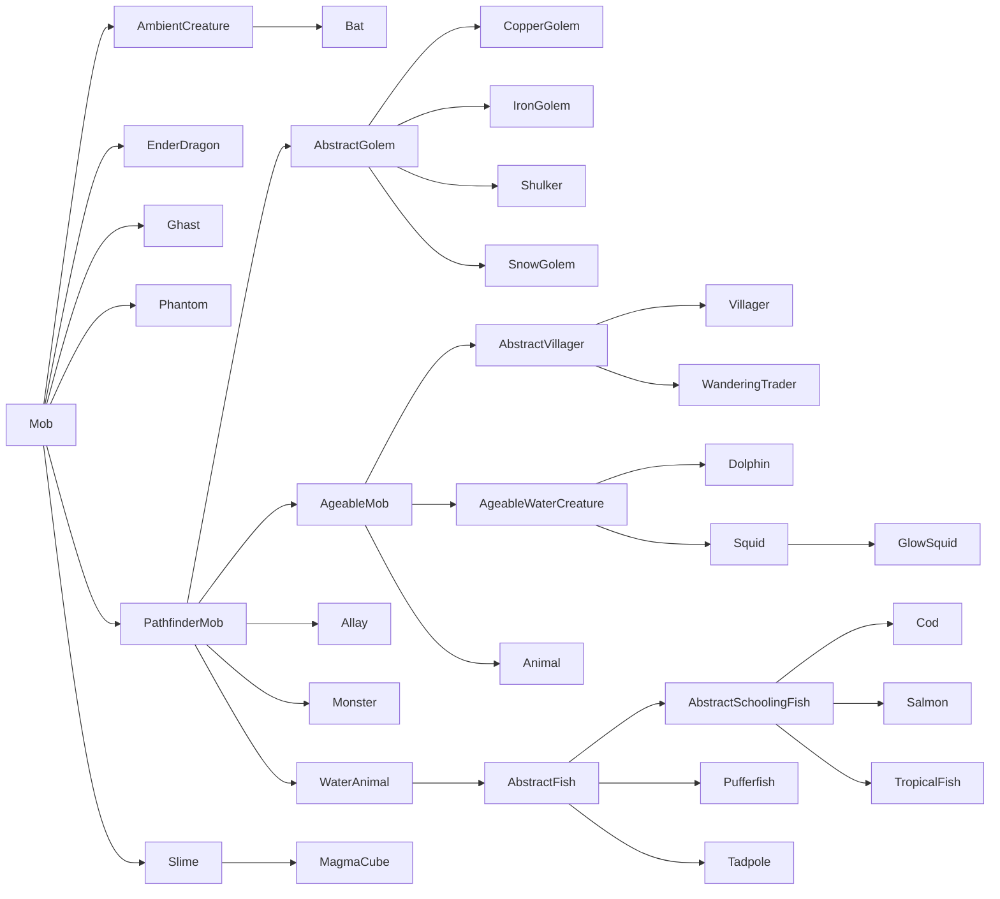
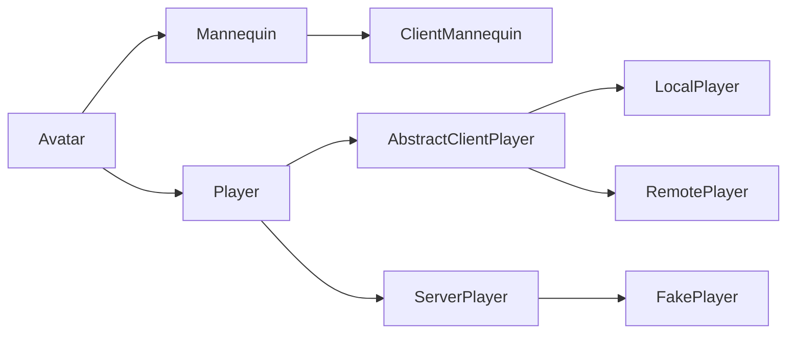

# 生命实体、生物、玩家（Living Entity、Mob & Player）

生命实体（LivingEntity）是 [Entity][entities] 的一个大型子群体，它们都继承了同样的 `LivingEntity` 超类。其中包括生物（继承 `Mob` 超类）、玩家（继承 `Player` 超类）与盔甲架（继承 `ArmorStand` 超类）。

LivingEntity 具有普通 Entity 所没有的多种额外 property，包括 [attribute][attributes]、[MobEffect][mobeffects]、伤害追踪等。

## 生命值、伤害与治疗

_另请参阅：[Attribute][attributes]。_

使 LivingEntity 有别于其他 Entity 的最显著功能之一，是完善的生命值系统。LivingEntity 通常有最大生命值、当前生命值，有时还具有盔甲或自然恢复等机制。

默认情况下，最大生命值由 `minecraft:max_health` [attribute][attributes] 决定，[生成][spawning]时会把当前生命值设置为相同数值。当对 Entity 调用 [`Entity#hurtServer`][hurt] 使其受到伤害时，会根据伤害计算降低当前生命值。许多 Entity（例如僵尸）默认会保持降低后的生命值，而玩家等一些 Entity 则能重新恢复失去的生命值。

要获取或设置最大生命值，可直接读取或写入 attribute：

```java
// Get the attribute map of our entity.
AttributeMap attributes = entity.getAttributes();

// Get the max health of our entity.
float maxHealth = attributes.getValue(Attributes.MAX_HEALTH);
// Shortcut for the above.
maxHealth = entity.getMaxHealth();

// Setting the max health must either be done by getting the AttributeInstance and calling #setBaseValue, or by
// adding an attribute modifier. We will do the former here. Please refer to the Attributes article for more details.
attributes.getInstance(Attributes.MAX_HEALTH).setBaseValue(50);
```

[受到伤害][damage]时，LivingEntity 会应用一些额外计算，例如考虑 `minecraft:armor` attribute（对于位于 `minecraft:bypasses_armor` [tag][tags] 中的[伤害类型][damagetypes]除外），以及 `minecraft:absorption` attribute。LivingEntity 还可覆盖 `#onDamageTaken` 来执行攻击后行为；只有最终伤害值大于零时才会调用该方法。

### 伤害事件

由于伤害流程十分复杂，因此提供了多个可供挂接的事件，它们按下列顺序触发。这通常用于修改并不属于你（或不一定属于你）的 Entity 所受伤害：例如修改 Minecraft 或其他模组中 Entity 所受的伤害，或修改任意 Entity 所受伤害，而该 Entity 可能属于你，也可能不属于你。

所有这些事件都会使用 `DamageContainer`。每次攻击开始时实例化新的 `DamageContainer`，攻击结束后将其丢弃。它包含原始 [`DamageSource`][damagesources]、原始伤害值，以及所有单独修改项的列表——盔甲、伤害吸收、[附魔][enchantments]、[MobEffect][mobeffects]等。`DamageContainer` 会传给下列所有事件，你可以检查已经进行的修改，再按需要自行更改。

#### `EntityInvulnerabilityCheckEvent`

此事件允许模组绕过或添加 Entity 的无敌状态。它也会为非 LivingEntity 触发。可以使用此事件使 Entity 免疫某次攻击，或移除其可能已有的免疫。

出于技术原因，挂接此事件的 hook 应当是确定性的，并且只依赖伤害类型。这意味着随机概率的无敌，或只在伤害量不超过某值时生效的无敌，应改在 `LivingIncomingDamageEvent` 中添加（见下文）。

#### `LivingIncomingDamageEvent`

此事件只在服务端调用，主要有两个用例：动态取消攻击，以及添加伤害减免 modifier 回调。

动态取消攻击基本等同于添加非确定性无敌，例如按随机概率取消伤害、取决于时间或所受伤害量的无敌等。稳定的无敌效果应通过 `EntityInvulnerabilityCheckEvent` 实现（见上文）。

减免 modifier 回调允许修改已执行伤害减免的某一部分。例如，它可以让盔甲的伤害减免效果降低 50%。随后，这种变化也会正确传递到 MobEffect，使其基于不同的伤害值继续计算，依此类推。可按如下方式添加减免 modifier 回调：

```java
@SubscribeEvent // on the game event bus
public static void decreaseArmor(LivingIncomingDamageEvent event) {
    // We only apply this decrease to players and leave zombies etc. unchanged
    if (event.getEntity() instanceof Player) {
        // Add our reduction modifier callback.
        event.addReductionModifier(
            // The reduction to target. See the DamageContainer.Reduction enum for possible values.
            DamageContainer.Reduction.ARMOR,
            // The modification to perform. Gets the damage container and the base reduction as inputs,
            // and outputs the new reduction. Both input and output reductions are floats.
            (container, baseReduction) -> baseReduction * 0.5f
        );
    }
}
```

回调按添加顺序应用。这意味着由更高[优先级][priority] 事件处理器添加的回调会先运行。

#### `LivingShieldBlockEvent`

此事件可用于完全自定义盾牌格挡，包括引入额外盾牌格挡、阻止盾牌格挡、修改 Vanilla 盾牌格挡检查、更改盾牌或攻击 Item 所受伤害、更改盾牌视角弧度、允许 Projectile 但阻挡近战攻击（或相反）、被动格挡攻击（即无需使用盾牌）、只格挡一定比例的伤害等。

请注意，此事件并非为“类似盾牌”的 Item 范围以外的免疫或攻击取消而设计。

#### `ArmorHurtEvent`

此事件应当相当直观。计算攻击对盔甲造成的伤害时触发，可用于修改各盔甲部件承受多少耐久损伤（如果有）。

#### `LivingDamageEvent.Pre`

此事件在实际造成伤害前立即调用。此时 `DamageContainer` 已完全填充，可以获取最终伤害值；事件不能再取消，因为到此时攻击已视为成功。

此时可以使用各种 modifier，以精细修改伤害值。请注意，盔甲耐久损伤等内容在此时已经发生。

#### `LivingDamageEvent.Post`

此事件在造成伤害、减少伤害吸收值、更新战斗 tracker，并处理统计与 game event 后调用。由于攻击已经发生，因此不可取消。此事件通常用于攻击后效果。请注意，即使伤害值为零也会触发事件，因此如有需要，请相应检查该值。

如果要在自己的 Entity 上调用此逻辑，应考虑改为覆盖 `ILivingEntityExtension#onDamageTaken()`。与 `LivingDamageEvent.Post` 不同，它只在伤害大于零时调用。

## MobEffect

_参见 [MobEffect 与 Potion][mobeffects]。_

## 装备

_参见 [Entity 上的容器][containers]。_

## 层次结构

LivingEntity 有复杂的类层次结构。如前所述，它有三个直接子类（红色类为 `abstract`，蓝色类不是）：



其中，`ArmorStand` 没有子类（也是唯一的非抽象类），因此下面重点介绍 `Mob` 与 `Avatar` 的类层次结构。

### `Mob` 的层次结构

`Mob` 的类层次结构如下（红色类为 `abstract`，蓝色类不是）：



图中缺少的所有其他 LivingEntity 都是 `Animal` 或 `Monster` 的子类。

你可能已经注意到，这十分混乱。例如，为什么蜜蜂、鹦鹉等不也是飞行 Mob？查看 `Animal` 与 `Monster` 的子类层次结构时，问题还会更加严重；本文不会详细讨论这些内容（如有兴趣，可使用 IDE 的 Show Hierarchy 功能查看）。最好了解这一点，但不必纠结。

下面介绍最重要的类：

- `PathfinderMob`：包含（不出所料！）寻路逻辑。
- `AgeableMob`：包含年龄增长与幼年 Entity 的逻辑。僵尸及其他具有幼年变体的怪物不会扩展此类，而是 `Monster` 的后代。
- `Animal`：大多数动物扩展的类。它还有 `AbstractHorse`、`TamableAnimal` 等更多抽象子类。
- `Monster`：游戏认为是怪物的大多数 Entity 使用的抽象类。与 `Animal` 类似，它还有 `AbstractPiglin`、`AbstractSkeleton`、`Raider` 和 `Zombie` 等更多抽象子类。
- `WaterAnimal`：鱼、鱿鱼与海豚等水生动物使用的抽象类。由于寻路方式显著不同，它们与其他动物分开。

### `Avatar` 的层次结构

Avatar 不仅定义玩家，还定义类似玩家的人偶。根据 Avatar 所在的端，会使用不同类。除了 `FakePlayer` 与 `Mannequin` 外，你绝不需要自行构造 Avatar。



- `AbstractClientPlayer`：用作两个客户端玩家类的基础；两者都用于表示[逻辑客户端][logicalsides]上的玩家。
- `LocalPlayer`：用于表示当前正在运行游戏的玩家。
- `RemotePlayer`：用于表示多人游戏中 `LocalPlayer` 可能遇到的其他玩家。因此，单人游戏 context 中不存在 `RemotePlayer`。
- `ServerPlayer`：用于表示[逻辑服务端][logicalsides]上的玩家。
- `FakePlayer`：`ServerPlayer` 的特殊子类，设计为玩家的模拟对象，供需要玩家 context 的非玩家机制使用。
- `Mannequin`：设计为可摆姿势的玩家，通常没有任何 AI。
- `ClientMannequin`：用于表示[逻辑客户端][logicalsides]上的人偶。

## 生成

除[常规生成方式][spawning]（即 `/summon` 命令，以及代码中通过 `EntityType#spawn` 或 `Level#addFreshEntity` 生成）外，`Mob` 还可通过其他方式生成。`ArmorStand` 可通过常规方式生成；除 `FakePlayer` 外，不应自行实例化 `Player`。

### 刷怪蛋

为 Mob [注册][register]刷怪蛋是常见做法（但非必需）。这通过 `SpawnEggItem` 类与 `DataComponents#ENTITY_DATA` [数据组件][datacomponent] 完成：

```java
// Assume we have a DeferredRegister.Items called ITEMS
DeferredItem<SpawnEggItem> MY_ENTITY_SPAWN_EGG = ITEMS.registerItem("my_entity_spawn_egg",
    properties -> new SpawnEggItem(
        // The properties passed into the lambda.
        // Using `spawnEgg` to set the DataComponent.
        // This is done in the lambda to prevent the entity type from resolving before registration.
        properties.spawnEgg(MY_ENTITY_TYPE.get())
    ));
```

作为与其他 Item 一样的 Item，应将其添加到[创造模式标签页][creative]，并添加[客户端 Item][clientitem]、[model][model] 与[翻译][translation]。

### 自然生成

_另请参阅 [Entity/`MobCategory`][mobcategory]、[世界生成／生物群系 Modifier／添加生成][addspawns]、[世界生成／生物群系 Modifier／添加生成成本][addspawncosts]，以及 [Minecraft Wiki][mcwiki] 上的[生成周期][spawncycle]。_

对于 `MobCategory#isFriendly()` 为 true 的 Entity（默认所有非怪物 Entity），每个 tick 都会执行自然生成；对于 `MobCategory#isFriendly()` 为 false 的 Entity（所有怪物），每 400 tick（即 20 秒）执行一次。如果 `MobCategory#isPersistent()` 返回 true（主要是动物），chunk 生成时也会额外执行此过程。

对于每个 chunk 与 MobCategory，都会检查是否达到生成上限。更具体地说，它会检查周围 `loadedChunks` 区域中，该 `MobCategory` 的 Entity 数量是否少于 `MobCategory#getMaxInstancesPerChunk() * loadedChunks / 289`；其中 `loadedChunks` 最多是以当前 chunk 为中心的 17×17 chunk 区域，如果实际加载的 chunk 更少（受渲染距离等因素影响），则使用更少的 chunk。

接着，对于每个 chunk，如果该 `MobCategory` 要进行生成，就要求至少一名玩家附近该类别的 Entity 数量少于 `MobCategory#getMaxInstancesPerChunk()`（“附近”表示 Mob 与玩家之间距离 ≤ 128），从而允许生成该 `MobCategory`。

如果满足条件，就从相关生物群系的生成数据中随机选择 entry；如果能找到合适位置，则进行生成。最多尝试三次寻找随机位置；如果找不到，则不会生成。

#### 示例

听起来很复杂？下面以平原生物群系中的动物为例进行说明。

在平原生物群系中，游戏每个 tick 都会尝试生成 `CREATURE` MobCategory 中的 Entity，该类别包含以下 entry：

```json5
[
    {"type": "minecraft:sheep",   "minCount": 4, "maxCount": 4, "weight": 12},
    {"type": "minecraft:pig",     "minCount": 4, "maxCount": 4, "weight": 10},
    {"type": "minecraft:chicken", "minCount": 4, "maxCount": 4, "weight": 10},
    {"type": "minecraft:cow",     "minCount": 4, "maxCount": 4, "weight": 8 },
    {"type": "minecraft:horse",   "minCount": 2, "maxCount": 6, "weight": 5 },
    {"type": "minecraft:donkey",  "minCount": 1, "maxCount": 3, "weight": 1 }
]
```

由于 `CREATURE` 的生成上限为 10，会扫描以每名玩家当前 chunk 为中心、最多 17×17 个 chunk 的区域，寻找其他 `CREATURE` 类型 Entity。如果找到的 Entity 数量 ≤ `10 * chunkCount / 289`（基本上只表示在未加载 chunk 附近，生成概率会提高），就会检查每个找到的 Entity 与最近玩家的距离。如果至少有一个 Entity 的距离大于 128，就可以进行生成。

如果所有检查都通过，就按 weight 从上述列表中选择生成 entry。假设选中了猪。随后游戏会检查 chunk 中的随机位置是否适合生成该 Entity。如果位置合适，就按生成数据中指定的最小与最大数量生成 Entity（本例恰好为 4 只猪）。如果位置不合适，游戏会用不同位置再试两次。如果仍找不到位置，则取消生成。

[addspawncosts]: ../worldgen/biomemodifier.md#添加生成代价
[addspawns]: ../worldgen/biomemodifier.md#添加生成
[attributes]: attributes.md
[clientitem]: ../resources/client/models/items.md
[containers]: ../inventories/container.md
[creative]: ../items/index.md#creative-tabs
[damage]: index.md#damaging-entities
[damagesources]: ../resources/server/damagetypes.md#创建和使用伤害来源
[damagetypes]: ../resources/server/damagetypes.md
[datacomponent]: ../items/datacomponents.md
[enchantments]: ../resources/server/enchantments/index.md
[entities]: index.md
[hurt]: index.md#damaging-entities
[logicalsides]: ../concepts/sides.md#the-logical-side
[mcwiki]: https://minecraft.wiki
[mobcategory]: index.md#mobcategory
[mobeffects]: ../items/mobeffects.md
[model]: ../resources/client/models/index.md
[priority]: ../concepts/events.md#priority
[register]: ../concepts/registries.md
[spawncycle]: https://minecraft.wiki/w/Mob_spawning#Spawn_cycle
[spawning]: index.md#spawning-entities
[tags]: ../resources/server/tags.md
[translation]: ../resources/client/i18n.md
