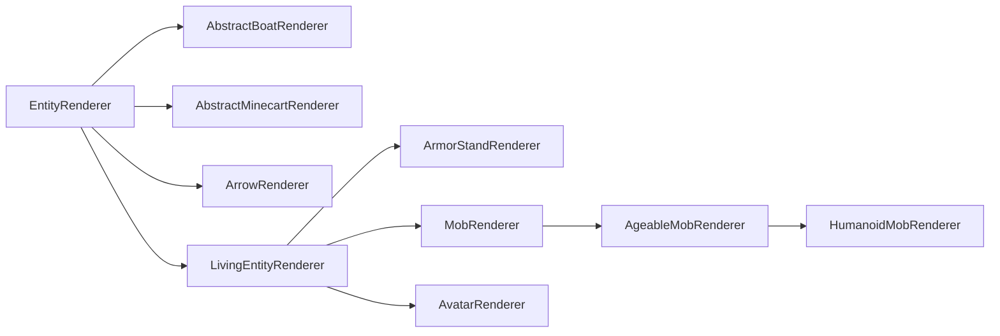

# 实体渲染器（Entity Renderer）

Entity Renderer 用于定义 Entity 的渲染行为。它只存在于 [逻辑客户端和物理客户端][sides]。

Entity 渲染使用所谓的 Entity Render State。简单来说，它是一个保存 Renderer 所需全部值的对象。每次渲染 Entity 时，Render State 都会更新，随后 `#submit` 方法使用它提交所需的[功能][features]，以便稍后渲染 Entity。

## 创建 Entity Renderer

最简单的 Entity Renderer 直接扩展 `EntityRenderer`：

```java
// The generic type in the superclass should be set to what entity you want to render.
// If you wanted to enable rendering for any entity, you'd use Entity, like we do here.
// You'd also use an EntityRenderState that fits your use case. More on this below.
public class MyEntityRenderer extends EntityRenderer<Entity, EntityRenderState> {
    // In our constructor, we just forward to super.
    public MyEntityRenderer(EntityRendererProvider.Context context) {
        super(context);
    }

    // Tell the render engine how to create a new entity render state.
    @Override
    public EntityRenderState createRenderState() {
        return new EntityRenderState();
    }

    // Update the render state by copying the needed values from the passed entity to the passed state.
    // Both Entity and EntityRenderState may be replaced with more concrete types,
    // based on the generic types that have been passed to the supertype.
    @Override
    public void extractRenderState(Entity entity, EntityRenderState state, float partialTick) {
        super.extractRenderState(entity, state, partialTick);
        // Extract and store any additional values in the state here.
    }
    
    // Actually submit the features of the entity to render.
    // The first parameter matches the render state's generic type.
    // Calling super will handle leash and name tag submission for you, if applicable.
    @Override
    public void submit(EntityRenderState renderState, PoseStack poseStack, SubmitNodeCollector collector, CameraRenderState cameraState) {
        super.submit(renderState, poseStack, collector, cameraState);
        // Do your own submission here
    }
}
```

有了 Entity Renderer 后，还需要注册它并将其连接到所属 Entity。这可在 [`EntityRenderersEvent.RegisterRenderers`][events] 中完成：

```java
@SubscribeEvent // on the mod event bus only on the physical client
public static void registerEntityRenderers(EntityRenderersEvent.RegisterRenderers event) {
    event.registerEntityRenderer(MY_ENTITY_TYPE.get(), MyEntityRenderer::new);
}
```

## Entity Render State

如前所述，Entity Render State 用于将渲染所用值与实际 Entity 的值分离。它本质上只是可变数据存储对象，因此非常容易扩展：

```java
public class MyEntityRenderState extends EntityRenderState {
    public ItemStackRenderState stackInHand;
}
```

就是这样。扩展该类、添加字段，并把 `EntityRenderer` 中的泛型类型改为你的类即可。最后只需按上文所述，在 `EntityRenderer#extractRenderState` 中更新 `stackInHand` 字段。

### 修改 Render State

除了可以定义新的 Entity Render State，NeoForge 还引入了修改现有 Render State 的系统。

为此，可以创建 `ContextKey<T>`（其中 `T` 是要更改的数据类型）并存入 static 字段。随后，可在 `RegisterRenderStateModifiersEvent` 的事件处理器中使用它：

```java
public static final ContextKey<String> EXAMPLE_CONTEXT = new ContextKey<>(
    // The id of your context key. Used for distinguishing between keys internally.
    Identifier.fromNamespaceAndPath("examplemod", "example_context"));

@SubscribeEvent // on the mod event bus only on the physical client
public static void registerRenderStateModifiers(RegisterRenderStateModifiersEvent event) {
    event.registerEntityModifier(
        // A TypeToken for the renderer. It is REQUIRED for this to be instantiated as an anonymous class
        // (i.e., with {} at the end) and to have explicit generic parameters, due to generics nonsense.
        new TypeToken<LivingEntityRenderer<LivingEntity, LivingEntityRenderState, ?>>(){},
        // The modifier itself. This is a BiConsumer of the entity and the entity render state.
        // Exact generic types are inferred from the generics in the renderer class used.
        (entity, state) -> state.setRenderData(EXAMPLE_CONTEXT, "Hello World!");
    );
    
    // Overload of the above method that accepts a Class<?>.
    // This should ONLY be used for renderers without any generics, such as PigRenderer.
    event.registerEntityModifier(
        PigRenderer.class,
        (entity, state) -> state.setRenderData(EXAMPLE_CONTEXT, "Hello World!");
    );

    // Convenience method for working around issues around modifying an avatar's
    // render state (e.g. players).
    event.registerAvatarEntityModifier(new AvatarRenderStateModifier() {
        @Override
        public <T extends Avatar & ClientAvatarEntity> void accept(T avatar, AvatarRenderState state) {
            state.setRenderData(EXAMPLE_CONTEXT, "Hello World!");
        }
    });
}
```

:::tip
把 `null` 作为第二个参数传给 `EntityRenderState#setRenderData` 即可清除值。例如：

```java
state.setRenderData(EXAMPLE_CONTEXT, null);
```

:::

需要时，可以通过 `EntityRenderState#getRenderData` 取回该数据。还可以使用 Helper Method `#getRenderDataOrThrow` 和 `#getRenderDataOrDefault`。

## 层次结构

与 Entity 本身一样，Entity Renderer 也有类层次结构，不过层级没有那么多。其中最重要的类关系如下（红色类为 `abstract`，蓝色类不是）：



- `EntityRenderer`：abstract 基类。许多 Renderer（尤其是几乎所有非 Living Entity 的 Renderer）都直接扩展它。
- `ArrowRenderer`、`AbstractBoatRenderer`、`AbstractMinecartRenderer`：主要为方便使用而存在，是更具体 Renderer 的父类。
- `LivingEntityRenderer`：[Living Entity][livingentity] Renderer 的 abstract 基类。直接子类包括 `ArmorStandRenderer` 和 `AvatarRenderer`。
- `ArmorStandRenderer`：含义不言自明。
- `AvatarRenderer`：用于渲染玩家等 Avatar。请注意，与多数 Renderer 不同，同一时间可能存在该类的多个实例，供不同上下文使用。
- `MobRenderer`：`Mob` Renderer 的 abstract 基类。许多 Renderer 直接扩展它。
- `AgeableMobRenderer`：具有幼年变体的 `Mob` Renderer 的 abstract 基类，也包括 Hoglin 等具有幼年变体的 Monster。
- `HumanoidMobRenderer`：人形 Entity Renderer 的 abstract 基类，例如 Zombie 和 Skeleton 会使用它。

与各种 Entity 类一样，请选择最符合用例的类。注意，很多类的泛型都具有相应类型边界；例如，`LivingEntityRenderer` 对 `LivingEntity` 和 `LivingEntityRenderState` 设有类型边界。

## Entity Model、Layer Definition 和 Render Layer

更复杂的 Entity Renderer（尤其是 `LivingEntityRenderer`）使用 Layer 系统，每一层都表示为一个 `RenderLayer`。一个 Renderer 可以使用多个 `RenderLayer`，并决定何时提交哪些 Layer。例如，Elytra 使用独立 Layer，不依赖穿戴它的 `LivingEntity` 单独处理。玩家 Cape 也同样是独立 Layer。

`RenderLayer` 定义一个 `#submit` 方法，它会提交渲染该 Layer 所需的[功能][features]。与多数其他 submit 方法一样，这里基本可以提交任何内容。不过，一种非常常见的用途是在此提交独立 Model，例如盔甲或类似装备。

为此，首先需要可供提交的 Model。我们使用 `Model` 类。`Model` 本质上是供 Renderer 使用的 Cube 及关联纹理列表。通常会在首次创建 Entity Renderer 的构造器时，以静态方式创建它。

:::note
由于现在处理的是 `LivingEntityRenderer`，以下代码假定 `MyEntity extends LivingEntity` 且 `MyEntityRenderState extends LivingEntityRenderState`，以满足泛型类型边界。
:::

### 创建 Entity Model 类和 Layer Definition

先创建 Entity Model 类：

```java
public class MyEntityModel extends EntityModel<MyEntityRenderState> {}
```

上例直接扩展 `EntityModel`；根据用例，使用其某个子类，甚至直接使用 `Model` 或 `Model` 的非 Entity 相关子类可能更加合适。创建新 Model 时，建议先查看最接近用例的现有 Model，再以此为基础进行开发。

接下来创建 `LayerDefinition`。`LayerDefinition` 本质上是可 Bake 为 `EntityModel` 的 Cube 列表。`LayerDefinition` 的定义方式如下：

```java
public class MyEntityModel extends EntityModel<MyEntityRenderState> {
    // A static method in which we create our layer definition. createBodyLayer() is the name
    // most vanilla models use. If you have multiple layers, you will have multiple of these static methods.
    public static LayerDefinition createBodyLayer() {
        // Create our mesh.
        MeshDefinition mesh = new MeshDefinition();
        // The mesh initially contains no object other than the root, which is invisible (has a size of 0x0x0).
        PartDefinition root = mesh.getRoot();
        // We add a head part.
        PartDefinition head = root.addOrReplaceChild(
            // The name of the part.
            "head",
            // The CubeListBuilder we want to add.
            CubeListBuilder.create()
                // The UV coordinates to use within the texture. Texture binding itself is explained below.
                // In this example, we start at U=10, V=20.
                .texOffs(10, 20)
                // Add our cube. May be called multiple times to add multiple cubes.
                // This is relative to the parent part. For the root part, it is relative to the entity's position.
                // Be aware that the y axis is flipped, i.e. "up" is subtractive and "down" is additive.
                .addBox(
                    // The top-left-back corner of the cube, relative to the parent object's position.
                    -5, -5, -5,
                    // The size of the cube.
                    10, 10, 10
                )
                // Call texOffs and addBox again to add another cube.
                .texOffs(30, 40)
                .addBox(-1, -1, -1, 1, 1, 1)
                // Various overloads of addBox() are available, which allow for additional operations
                // such as texture mirroring, texture scaling, specifying the directions to be rendered,
                // and a global scale to all cubes, known as a CubeDeformation.
                // This example uses the latter, please check the usages of the individual methods for more examples.
                .texOffs(50, 60)
                .addBox(5, 5, 5, 4, 4, 4, CubeDeformation.extend(1.2f)),
            // The initial positioning to apply to all elements of the CubeListBuilder. Besides PartPose#offset,
            // PartPose#offsetAndRotation is also available. This can be reused across multiple PartDefinitions.
            // This may not be used by all models. For example, making custom armor layers will use the associated
            // player (or other humanoid) renderer's PartPose instead to have the armor "snap" to the player model.
            PartPose.offset(0, 8, 0)
        );
        // We can now add children to any PartDefinition, thus creating a hierarchy.
        PartDefinition part1 = root.addOrReplaceChild(...);
        PartDefinition part2 = head.addOrReplaceChild(...);
        PartDefinition part3 = part1.addOrReplaceChild(...);
        // At the end, we create a LayerDefinition from the MeshDefinition.
        // The two integers are the expected dimensions of the texture; 64x32 in our example.
        return LayerDefinition.create(mesh, 64, 32);
    }
}
```

:::tip
[Blockbench][blockbench] 建模程序非常有助于创建 Entity Model。为此，在 Blockbench 中创建 Model 时请选择 Modded Entity 选项。

Blockbench 还提供将 Model 导出为 `LayerDefinition` 创建方法的选项，位于 `File -> Export -> Export Java Entity`。
:::

### 注册 Layer Definition

有了 Entity Layer Definition 后，需要在 `EntityRenderersEvent.RegisterLayerDefinitions` 中注册它。为此，需要使用 `ModelLayerLocation`，它实质上是 Layer 的 Identifier（请记住，一个 Entity 可以有多个 Layer）。

```java
// Our ModelLayerLocation.
public static final ModelLayerLocation MY_LAYER = new ModelLayerLocation(
    // Should be the name of the entity this layer belongs to.
    // May be more generic if this layer can be used on multiple entities.
    Identifier.fromNamespaceAndPath("examplemod", "example_entity"),
    // The name of the layer itself. Should be main for the entity's base model,
    // and a more descriptive name (e.g. "wings") for more specific layers.
    "main"
);

@SubscribeEvent // on the mod event bus only on the physical client
public static void registerLayerDefinitions(EntityRenderersEvent.RegisterLayerDefinitions event) {
    // Add our layer here.
    event.add(MY_LAYER, MyEntityModel::createBodyLayer);
}
```

### 创建 Render Layer 并 Bake Layer Definition

下一步是 Bake Layer Definition；首先回到 Entity Model 类：

```java
public class MyEntityModel extends EntityModel<MyEntityRenderState> {
    // Storing specific model parts as fields for use below.
    private final ModelPart head;
    
    // The ModelPart passed here is the root of our baked model.
    // We will get to the actual baking in just a moment.
    public MyEntityModel(ModelPart root) {
        // The super constructor call can optionally specify a RenderType.
        super(root);
        // Store the head part for use below.
        this.head = root.getChild("head");
    }

    public static LayerDefinition createBodyLayer() {...}

    // Use this method to update the model rotations, visibility etc. from the render state. If you change the
    // generic parameter of the EntityModel superclass, this parameter type changes with it.
    @Override
    public void setupAnim(MyEntityRenderState state) {
        // Calling super to reset all values to default.
        super.setupAnim(state);
        // Change the model parts.
        head.visible = state.myBoolean();
        head.xRot = state.myXRotation();
        head.yRot = state.myYRotation();
        head.zRot = state.myZRotation();
    }
}
```

现在 Model 已能正确接收 Bake 后的 `ModelPart`，可以创建 `RenderLayer` 子类，并用它 Bake `LayerDefinition`：

```java
// The generic parameters need the proper types you used everywhere else up to this point.
public class MyRenderLayer extends RenderLayer<MyEntityRenderState, MyEntityModel> {
    private final MyEntityModel model;
    
    // Create the render layer. The renderer parameter is required for passing to super.
    // Other parameters can be added as needed. For example, we need the EntityModelSet for model baking.
    public MyRenderLayer(MyEntityRenderer renderer, EntityModelSet entityModelSet) {
        super(renderer);
        // Bake and store our layer definition, using the ModelLayerLocation from back when we registered the layer definition.
        // If applicable, you can also store multiple models this way and use them below.
        this.model = new MyEntityModel(entityModelSet.bakeLayer(MY_LAYER));
    }

    @Override
    public void submit(PoseStack poseStack, SubmitNodeCollector collector, int lightCoords, MyEntityRenderState renderState, float yRot, float xRot) {
        // Submit the features for the layer here. We have stored the entity model in a field, you probably want to use it in some way.
        collector
            .order(1) // We submit the feature on a later iteration so it renders on top of the entity
            .submitModel(this.model, renderState, poseStack, ...);
    }
}
```

### 向 Entity Renderer 添加 Render Layer

最后，把 Layer 添加到 Renderer（现在它必须是 Living Renderer），将所有部分连接起来：

```java
// Plugging in our custom render state class as the generic type.
// Also, we need to implement RenderLayerParent. Some existing renderers, such as LivingEntityRenderer, do this for you.
public class MyEntityRenderer extends LivingEntityRenderer<MyEntity, MyEntityRenderState, MyEntityModel> {
    public MyEntityRenderer(EntityRendererProvider.Context context) {
        // For LivingEntityRenderer, the super constructor requires a "base" model and a shadow radius to be supplied.
        super(context, new MyEntityModel(context.bakeLayer(MY_LAYER)), 0.5f);
        // Add the layer. Get the EntityModelSet from the context. For the purpose of the example,
        // we ignore that the render layer submits the "base" model, this would be a different model in practice.
        this.addLayer(new MyRenderLayer(this, context.getModelSet()));
    }

    @Override
    public MyEntityRenderState createRenderState() {
        return new MyEntityRenderState();
    }

    @Override
    public void extractRenderState(MyEntity entity, MyEntityRenderState state, float partialTick) {
        super.extractRenderState(entity, state, partialTick);
        // Extract your own stuff here, see the beginning of the article.
    }

    @Override
    public void submit(MyEntityRenderState renderState, PoseStack poseStack, SubmitNodeCollector collector, CameraRenderState cameraState) {
        // Calling super will automatically submit the features of the layer for you.
        super.submit(renderState, poseStack, collector, cameraState);
        // Then, do custom submission here, if applicable.
    }

    // getTextureLocation is an abstract method in LivingEntityRenderer that we need to override.
    // The texture path is relative to the namespace, so it must specify the exact path within the namespace in the assets directory.
    // In this example, the texture should be located at `assets/examplemod/textures/entity/example_entity.png`.
    // The texture will then be supplied to and used by the model.
    @Override
    public Identifier getTextureLocation(MyEntityRenderState state) {
        return Identifier.fromNamespaceAndPath("examplemod", "textures/entity/example_entity.png");
    }
}
```

### 完整汇总

内容有点多？由于该系统十分复杂，下面再次列出所有组件，几乎不再附加说明：

```java
public class MyEntity extends LivingEntity {...}
```

```java
public class MyEntityRenderState extends LivingEntityRenderState {...}
```

```java
public class MyEntityModel extends EntityModel<MyEntityRenderState> {
    public static final ModelLayerLocation MY_LAYER = new ModelLayerLocation(
            Identifier.fromNamespaceAndPath("examplemod", "example_entity"),
            "main"
    );
    private final ModelPart head;
    
    public MyEntityModel(ModelPart root) {
        super(root);
        this.head = root.getChild("head");
        // ...
    }

    public static LayerDefinition createBodyLayer() {
        MeshDefinition mesh = new MeshDefinition();
        PartDefinition root = mesh.getRoot();
        PartDefinition head = root.addOrReplaceChild(
            "head",
            CubeListBuilder.create().texOffs(10, 20).addBox(-5, -5, -5, 10, 10, 10),
            PartPose.offset(0, 8, 0)
        );
        // ...
        return LayerDefinition.create(mesh, 64, 32);
    }

    @Override
    public void setupAnim(MyEntityRenderState state) {
        super.setupAnim(state);
        // ...
    }
}
```

```java
public class MyRenderLayer extends RenderLayer<MyEntityRenderState, MyEntityModel> {
    private final MyEntityModel model;
    
    public MyRenderLayer(MyEntityRenderer renderer, EntityModelSet entityModelSet) {
        super(renderer);
        this.model = new MyEntityModel(entityModelSet.bakeLayer(MY_LAYER));
    }

    @Override
    public void submit(PoseStack poseStack, SubmitNodeCollector collector, int lightCoords, MyEntityRenderState renderState, float yRot, float xRot) {
        // ...
    }
}
```

```java
public class MyEntityRenderer extends LivingEntityRenderer<MyEntity, MyEntityRenderState, MyEntityModel> {
    public MyEntityRenderer(EntityRendererProvider.Context context) {
        super(context, new MyEntityModel(context.bakeLayer(MY_LAYER)), 0.5f);
        this.addLayer(new MyRenderLayer(this, context.getModelSet()));
    }

    @Override
    public MyEntityRenderState createRenderState() {
        return new MyEntityRenderState();
    }

    @Override
    public void extractRenderState(MyEntity entity, MyEntityRenderState state, float partialTick) {
        super.extractRenderState(entity, state, partialTick);
        // ...
    }

    @Override
    public void submit(MyEntityRenderState renderState, PoseStack poseStack, SubmitNodeCollector collector, CameraRenderState cameraState) {
        super.submit(renderState, poseStack, collector, cameraState);
        // ...
    }

    @Override
    public Identifier getTextureLocation(MyEntityRenderState state) {
        return Identifier.fromNamespaceAndPath("examplemod", "textures/entity/example_entity.png");
    }
}
```

```java
@SubscribeEvent // on the mod event bus only on the physical client
public static void registerLayerDefinitions(EntityRenderersEvent.RegisterLayerDefinitions event) {
    event.add(MyEntityModel.MY_LAYER, MyEntityModel::createBodyLayer);
}

@SubscribeEvent // on the mod event bus only on the physical client
public static void registerEntityRenderers(EntityRenderersEvent.RegisterRenderers event) {
    event.registerEntityRenderer(MY_ENTITY_TYPE.get(), MyEntityRenderer::new);
}
```

## 修改现有 Entity Renderer

某些情况下，需要为现有 Entity Renderer 添加内容，例如在现有 Entity 上渲染额外效果。多数时候，这会影响 Living Entity，即使用 `LivingEntityRenderer` 的 Entity。这使我们可以按如下方式向 Entity 添加 [Render Layer][renderlayer]：

```java
@SubscribeEvent // on the mod event bus only on the physical client
public static void addLayers(EntityRenderersEvent.AddLayers event) {
    // Add a layer to every single entity type.
    for (EntityType<?> entityType : event.getEntityTypes()) {
        // Get our renderer.
        EntityRenderer<?, ?> renderer = event.getRenderer(entityType);
        // We check if our render layer is supported by the renderer.
        // If you want a more general-purpose render layer, you will need to work with wildcard generics.
        if (renderer instanceof MyEntityRenderer myEntityRenderer) {
            // Add the layer to the renderer. Like above, construct a new MyRenderLayer.
            // The EntityModelSet can be retrieved from the event through #getEntityModels.
            myEntityRenderer.addLayer(new MyRenderLayer(renderer, event.getEntityModels()));
        }
    }
}
```

对于玩家，需要做一些特殊处理，因为实际上可能存在多个 Player Renderer。事件会分别管理它们，可以按如下方式进行交互：

```java
@SubscribeEvent // on the mod event bus only on the physical client
public static void addPlayerLayers(EntityRenderersEvent.AddLayers event) {
    // Iterate over all possible player models.
    for (PlayerModelType type : event.getSkins()) {
        // Get the associated AvatarRenderer.
        AvatarRenderer<AbstractClientPlayer> playerRenderer = event.getPlayerRenderer(type);
        if (playerRenderer != null) {
            // Add the layer to the renderer. This assumes that the render layer
            // has proper generics to support players and player renderers.
            playerRenderer.addLayer(new MyRenderLayer(playerRenderer, event.getEntityModels()));
        }
    }
}
```

## 动画

Minecraft 通过 `AnimationDefinition` 类为 Entity Model 提供动画系统。NeoForge 增加了一个系统，允许像 [GeckoLib][geckolib] 等第三方库一样，在 JSON 文件中定义这些 Entity 动画。

动画定义在 `assets/<namespace>/neoforge/animations/entity/<path>.json` 的 JSON 文件中（因此，对于 [Resource Location][rl] `examplemod:example`，文件位于 `assets/examplemod/neoforge/animations/entity/example.json`）。动画文件格式如下：

```json5
{
    // The duration of the animation, in seconds.
    "length": 1.5,
    // Whether the animation should loop (true) or stop (false) when finished.
    // Optional, defaults to false.
    "loop": true,
    // A list of parts to be animated, and their animation data.
    "animations": [
        {
            // The name of the part to be animated. Must match the name of a part
            // defined in your LayerDefinition (see above). If there are multiple matches,
            // the first match from the performed depth-first search will be picked.
            "bone": "head",
            // The value to be changed. See below for available targets.
            "target": "minecraft:rotation",
            // A list of keyframes for the part.
            "keyframes": [
                {
                    // The timestamp of the keyframe, in seconds.
                    // Should be between 0 and the animation length.
                    "timestamp": 0.5,
                    // The actual "value" of the keyframe.
                    "target": [22.5, 0, 0],
                    // The interpolation method to use. See below for available methods.
                    "interpolation": "minecraft:linear"
                }
            ]
        }
    ]
}
```

:::tip
强烈建议将此系统与 [Blockbench][blockbench] 建模软件结合使用；它提供[动画转 JSON 插件][bbplugin]。
:::

随后，可以在 Model 中按如下方式使用动画：

```java
public class MyEntityModel extends EntityModel<MyEntityRenderState> {
    // Create and store a reference to the animation holder.
    public static final AnimationHolder EXAMPLE_ANIMATION =
            Model.getAnimation(Identifier.fromNamespaceAndPath("examplemod", "example"));

    // A field to hold the baked animation
    private final KeyframeAnimation example;

    public MyEntityModel(ModelPart root) {
        // Bake the animation for the model
        // Pass in whatever 'ModelPart' that the animation is applied to
        // It should cover all referenced bones
        this.example = EXAMPLE_ANIMATION.get().bake(root);
    }
    
    // Other stuff here.
    
    @Override
    public void setupAnim(MyEntityRenderState state) {
        super.setupAnim(state);
        // Other stuff here.
        
        this.example.apply(
            // Get the animation state to use from your EntityRenderState.
            state.myAnimationState,
            // Your entity age, in ticks.
            state.ageInTicks
        );
        // A specialized version of apply(), designed for walking animations.
        this.example.applyWalk(state.walkAnimationPos, state.walkAnimationSpeed, 1, 1);
        // A version of apply() that only applies the first frame of animation.
        this.example.applyStatic();
    }
}
```

### Keyframe Target

NeoForge 默认添加以下 Keyframe Target：

- `minecraft:position`：将目标值设为 Part 的位置值。
- `minecraft:rotation`：将目标值设为 Part 的旋转值。
- `minecraft:scale`：将目标值设为 Part 的缩放值。

可以创建新的 `AnimationTarget`，并在 `RegisterJsonAnimationTypesEvent` 中注册，从而添加自定义值：

```java
@SubscribeEvent // on the mod event bus only on the physical client
public static void registerJsonAnimationTypes(RegisterJsonAnimationTypesEvent event) {
    event.registerTarget(
        // The name of the new target, to be used in JSON and other places.
        Identifier.fromNamespaceAndPath("examplemod", "example"),
        // The AnimationTarget to register.
        new AnimationTarget(...)
    );
}
```

### Keyframe 插值

NeoForge 默认添加以下 Keyframe 插值：

- `minecraft:linear`：线性插值。
- `minecraft:catmullrom`：沿 [Catmull-Rom Spline][catmullrom] 插值。

可以创建新的 `AnimationChannel.Interpolation`（函数式接口），并在 `RegisterJsonAnimationTypesEvent` 中注册，从而添加自定义插值：

```java
@SubscribeEvent // on the mod event bus only on the physical client
public static void registerJsonAnimationTypes(RegisterJsonAnimationTypesEvent event) {
    event.registerInterpolation(
        // The name of the new interpolation, to be used in JSON and other places.
        Identifier.fromNamespaceAndPath("examplemod", "example"),
        // The AnimationChannel.Interpolation to register.
        (vector, keyframeDelta, keyframes, currentKeyframe, nextKeyframe, scale) -> {...}
    );
}
```

[bbplugin]: https://www.blockbench.net/plugins/animation_to_json
[blockbench]: https://www.blockbench.net/
[catmullrom]: https://en.wikipedia.org/wiki/Cubic_Hermite_spline#Catmull–Rom_spline
[events]: ../concepts/events.md
[features]: ../rendering/feature.md
[geckolib]: https://github.com/bernie-g/geckolib
[livingentity]: livingentity.md
[renderlayer]: #creating-a-render-layer-and-baking-a-layer-definition
[rl]: ../misc/identifier.md
[sides]: ../concepts/sides.md
