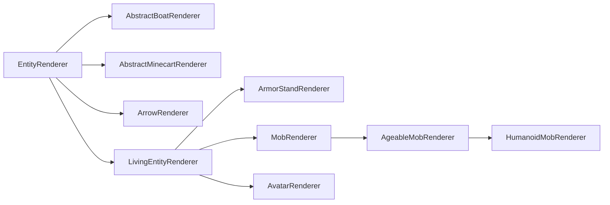

# 实体渲染器（Entity Renderer）

实体渲染器用于定义实体的渲染行为。它只存在于 [逻辑客户端和物理客户端][sides]。

实体渲染使用所谓的实体渲染状态（Entity Render State）。简单来说，它是一个保存渲染器所需全部值的对象。每次渲染实体时，渲染状态都会更新，随后 `#submit` 方法使用它提交所需的 [Feature][features]，以便稍后渲染实体。

## 创建实体渲染器

最简单的实体渲染器直接扩展 `EntityRenderer`：

```java
// 父类中的泛型类型应设置为要渲染的实体。
// 如果你想为任何实体启用渲染，你可以使用实体，就像我们在这里所做的那样。
// 你还可以使用适合你的用例的 EntityRenderState。有关其更多信息如下。
public class MyEntityRenderer extends EntityRenderer<Entity, EntityRenderState> {
    // 在我们的构造器中，我们只是转发到 super。
    public MyEntityRenderer(EntityRendererProvider.Context context) {
        super(context);
    }

    // 告诉渲染引擎如何创建新实体渲染状态。
    @Override
    public EntityRenderState createRenderState() {
        return new EntityRenderState();
    }

    // 通过将所需的值从传递的实体复制到传递的状态来更新渲染状态。
    // 实体和 EntityRenderState 都可以替换为更具体的类型，
    // 基于已传递给超类型的泛型类型。
    @Override
    public void extractRenderState(Entity entity, EntityRenderState state, float partialTick) {
        super.extractRenderState(entity, state, partialTick);
        // 提取任何附加值并将其存储在此处的状态中。
    }
    
    // 实际提交渲染实体所需的 Feature。
    // 第一个参数与渲染状态的泛型类型匹配。
    // 调用 super 会为你处理拴绳和名牌提交（如果适用）。
    @Override
    public void submit(EntityRenderState renderState, PoseStack poseStack, SubmitNodeCollector collector, CameraRenderState cameraState) {
        super.submit(renderState, poseStack, collector, cameraState);
        // 在此自行提交
    }
}
```

有了实体渲染器后，还需要注册它并将其连接到所属实体。这可在 [`EntityRenderersEvent.RegisterRenderers`][events] 中完成：

```java
@SubscribeEvent // 仅在物理客户端上的模组事件总线上
public static void registerEntityRenderers(EntityRenderersEvent.RegisterRenderers event) {
    event.registerEntityRenderer(MY_ENTITY_TYPE.get(), MyEntityRenderer::new);
}
```

## 实体渲染状态

如前所述，实体渲染状态用于将渲染所用值与实际实体的值分离。它本质上只是可变数据存储对象，代码中通常对应 `EntityRenderState` 及其子类，因此非常容易扩展：

```java
public class MyEntityRenderState extends EntityRenderState {
    public ItemStackRenderState stackInHand;
}
```

就是这样。扩展该类、添加字段，并把 `EntityRenderer` 中的泛型类型改为你的类即可。最后只需按上文所述，在 `EntityRenderer#extractRenderState` 中更新 `stackInHand` 字段。

### 修改渲染状态

除了可以定义新的实体渲染状态，NeoForge 还引入了渲染状态修改系统（Render State Modifications），用于修改现有渲染状态。

为此，可以创建 `ContextKey<T>`（其中 `T` 是要更改的数据类型）并存入静态字段。随后，可在 `RegisterRenderStateModifiersEvent` 的事件处理器中使用它：

```java
public static final ContextKey<String> EXAMPLE_CONTEXT = new ContextKey<>(
    // 你的上下文键的 ID。用于在内部区分不同的键。
    Identifier.fromNamespaceAndPath("examplemod", "example_context"));

@SubscribeEvent // 仅在物理客户端上的模组事件总线上
public static void registerRenderStateModifiers(RegisterRenderStateModifiersEvent event) {
    event.registerEntityModifier(
        // 渲染器的 TypeToken。受 Java 泛型限制，这里必须实例化为匿名类
        // （即末尾带有 {}），并且需要显式指定泛型参数。
        new TypeToken<LivingEntityRenderer<LivingEntity, LivingEntityRenderState, ?>>(){},
        // 修饰符本身。这是实体和实体渲染状态的 BiConsumer。
        // 精确的泛型类型是从所使用的渲染器类中的泛型推断出来的。
        (entity, state) -> state.setRenderData(EXAMPLE_CONTEXT, "Hello World!");
    );
    
    // 接受 Class<?> 的上述方法的重载。
    // 这应当仅用于不带任何泛型的渲染器，例如 PigRenderer。
    event.registerEntityModifier(
        PigRenderer.class,
        (entity, state) -> state.setRenderData(EXAMPLE_CONTEXT, "Hello World!");
    );

    // 用于绕过修改 avatar 渲染状态（例如玩家）时遇到的问题的便捷方法。
    event.registerAvatarEntityModifier(new AvatarRenderStateModifier() {
        @Override
        public <T extends Avatar & ClientAvatarEntity> void accept(T avatar, AvatarRenderState state) {
            state.setRenderData(EXAMPLE_CONTEXT, "Hello World!");
        }
    });
}
```

:::tip
把 `null` 作为第二个参数传给 `EntityRenderState#setRenderData` 即可清除值。例如：

```java
state.setRenderData(EXAMPLE_CONTEXT, null);
```

:::

需要时，可以通过 `EntityRenderState#getRenderData` 取回该数据。还可以使用辅助方法 `#getRenderDataOrThrow` 和 `#getRenderDataOrDefault`。

## 层次结构

与实体本身一样，实体渲染器也有类层次结构，不过层级没有那么多。其中最重要的类关系如下（红色类为 `abstract`，蓝色类不是）：



- `EntityRenderer`：抽象基类。许多渲染器（尤其是几乎所有非生命实体的渲染器）都直接扩展它。
- `ArrowRenderer`、`AbstractBoatRenderer`、`AbstractMinecartRenderer`：主要为方便使用而存在，是更具体渲染器的父类。
- `LivingEntityRenderer`：[生命实体][livingentity]渲染器的抽象基类。直接子类包括 `ArmorStandRenderer` 和 `AvatarRenderer`。
- `ArmorStandRenderer`：含义不言自明。
- `AvatarRenderer`：用于渲染玩家等 Avatar。请注意，与多数渲染器不同，同一时间可能存在该类的多个实例，供不同上下文使用。
- `MobRenderer`：`Mob` 渲染器的抽象基类。许多渲染器直接扩展它。
- `AgeableMobRenderer`：具有幼年变体的 `Mob` 渲染器的抽象基类，也包括疣猪兽等具有幼年变体的怪物。
- `HumanoidMobRenderer`：人形实体渲染器的抽象基类，例如僵尸和骷髅会使用它。

与各种实体类一样，请选择最符合用例的类。注意，很多类的泛型都具有相应类型边界；例如，`LivingEntityRenderer` 对 `LivingEntity` 和 `LivingEntityRenderState` 设有类型边界。

## 实体模型、层定义和渲染层

本节涉及实体模型（Entity Model）、层定义（Layer Definition）和渲染层（Render Layer）三个概念。更复杂的实体渲染器（尤其是 `LivingEntityRenderer`）使用层（Layer）系统，每一层都表示为一个 `RenderLayer`。一个渲染器可以使用多个 `RenderLayer`，并决定何时提交哪些层。例如，鞘翅使用独立层，不依赖穿戴它的 `LivingEntity` 单独处理。玩家披风也同样是独立层。

`RenderLayer` 定义一个 `#submit` 方法，它会提交渲染该层所需的 [Feature][features]。与多数其他提交方法一样，这里基本可以提交任何内容。不过，一种非常常见的用途是在此提交独立模型，例如盔甲或类似装备。

为此，首先需要可供提交的模型。我们使用 `Model` 类。`Model` 本质上是供渲染器使用的立方体及关联纹理列表。通常会在首次创建实体渲染器的构造器时，以静态方式创建它。

:::info
由于现在处理的是 `LivingEntityRenderer`，以下代码假定 `MyEntity extends LivingEntity` 且 `MyEntityRenderState extends LivingEntityRenderState`，以满足泛型类型边界。
:::

### 创建实体模型类和层定义

先创建实体模型（Entity Model）类：

```java
public class MyEntityModel extends EntityModel<MyEntityRenderState> {}
```

上例直接扩展 `EntityModel`；根据用例，使用其某个子类，甚至直接使用 `Model` 或 `Model` 的非实体相关子类可能更加合适。创建新模型时，建议先查看最接近用例的现有模型，再以此为基础进行开发。

接下来创建层定义（Layer Definition），也就是 `LayerDefinition`。`LayerDefinition` 本质上是可烘焙为 `EntityModel` 的立方体列表。定义方式如下：

```java
public class MyEntityModel extends EntityModel<MyEntityRenderState> {
    // 一个 static 方法，我们在其中创建层定义。createBodyLayer() 是
    // 大多数原版模型使用的名称。如果你有多个层，就会有多个这样的 static 方法。
    public static LayerDefinition createBodyLayer() {
        // 创建我们的网格。
        MeshDefinition mesh = new MeshDefinition();
        // 网格最初除根部之外不包含任何对象，根部不可见（大小为 0x0x0）。
        PartDefinition root = mesh.getRoot();
        // 我们添加了头部部分。
        PartDefinition head = root.addOrReplaceChild(
            // 零件的名称。
            "head",
            // 我们要添加的 CubeListBuilder。
            CubeListBuilder.create()
                // 在纹理内使用的 UV 坐标。下面解释纹理绑定本身。
                // 在本例中，从 U=10、V=20 开始。
                .texOffs(10, 20)
                // 添加我们的立方体。可以多次调用以添加多个立方体。
                // 这是相对于父部件的。对于根部分来说，它是相对于实体的位置而言的。
                // 请注意，y 轴已翻转，即 "up" 是减法，"down" 是加法。
                .addBox(
                    // 立方体的左上角，相对于父对象的位置。
                    -5, -5, -5,
                    // 立方体的大小。
                    10, 10, 10
                )
                // 再次调用 texOffs 和 addBox 添加另一个立方体。
                .texOffs(30, 40)
                .addBox(-1, -1, -1, 1, 1, 1)
                // addBox() 的各种重载可用，允许执行附加操作，
                // 如纹理镜像、纹理缩放、指定要渲染的方向、
                // 以及应用于所有立方体的全局缩放，称为 CubeDeformation。
                // 本示例使用后者，更多示例请查看各个方法的用法。
                .texOffs(50, 60)
                .addBox(5, 5, 5, 4, 4, 4, CubeDeformation.extend(1.2f)),
            // 适用于 CubeListBuilder 的所有元素的初始定位。除了 PartPose#offset 之外，
            // PartPose#offsetAndRotation 也可用。这可以在多个 PartDefinitions 之间重复使用。
            // 这可能不适用于所有模型。例如，制作自定义盔甲层将使用关联的
            // 玩家（或其他人形）渲染器的 PartPose，使盔甲“贴合”玩家模型。
            PartPose.offset(0, 8, 0)
        );
        // 我们现在可以将子项添加到任何 PartDefinition，从而创建层次结构。
        PartDefinition part1 = root.addOrReplaceChild(...);
        PartDefinition part2 = head.addOrReplaceChild(...);
        PartDefinition part3 = part1.addOrReplaceChild(...);
        // 最后，我们从 MeshDefinition 创建一个 LayerDefinition。
        // 这两个整数是纹理的预期尺寸；在我们的示例中为 64x32。
        return LayerDefinition.create(mesh, 64, 32);
    }
}
```

:::tip
[Blockbench][blockbench] 建模程序非常有助于创建实体模型。为此，在 Blockbench 中创建模型时请选择 Modded Entity 选项。

Blockbench 还提供将模型导出为 `LayerDefinition` 创建方法的选项，位于 `File -> Export -> Export Java Entity`。
:::

### 注册层定义

有了实体层（Layer Definition）定义后，需要在 `EntityRenderersEvent.RegisterLayerDefinitions` 中注册它。为此，需要使用 `ModelLayerLocation`，它实质上是该层的 `Identifier`（请记住，一个实体可以有多个层）。

```java
// 我们的 ModelLayerLocation。
public static final ModelLayerLocation MY_LAYER = new ModelLayerLocation(
    // 应为此层所属实体的名称。
    // 如果此层可用于多个实体，则可能更通用。
    Identifier.fromNamespaceAndPath("examplemod", "example_entity"),
    // 层本身的名称。实体基础模型通常使用 main，
    // 更具体的层则使用更具描述性的名称（例如 "wings"）。
    "main"
);

@SubscribeEvent // 仅在物理客户端上的模组事件总线上
public static void registerLayerDefinitions(EntityRenderersEvent.RegisterLayerDefinitions event) {
    // 在这里添加我们的层。
    event.add(MY_LAYER, MyEntityModel::createBodyLayer);
}
```

### 创建渲染层并烘焙层定义

下一步是烘焙层定义（Layer Definition）；首先回到实体模型类：

```java
public class MyEntityModel extends EntityModel<MyEntityRenderState> {
    // 将特定模型零件存储为字段以供下面使用。
    private final ModelPart head;
    
    // 这里传递的 ModelPart 是我们烘焙模型的根。
    // 我们很快就会开始实际的烘焙。
    public MyEntityModel(ModelPart root) {
        // super 构造器调用可以选择指定 RenderType。
        super(root);
        // 存储 head 部件以供下面使用。
        this.head = root.getChild("head");
    }

    public static LayerDefinition createBodyLayer() {...}

    // 使用此方法从渲染状态更新模型旋转、可见性等。如果你更改
    // EntityModel 超类的泛型参数，此参数类型随之变化。
    @Override
    public void setupAnim(MyEntityRenderState state) {
        // 调用 super 将所有值重置为默认值。
        super.setupAnim(state);
        // 更改模型零件。
        head.visible = state.myBoolean();
        head.xRot = state.myXRotation();
        head.yRot = state.myYRotation();
        head.zRot = state.myZRotation();
    }
}
```

现在模型已能正确接收烘焙后的 `ModelPart`，可以创建渲染层（Render Layer）的 `RenderLayer` 子类，并用它烘焙 `LayerDefinition`：

```java
// 泛型参数需要与前文其他位置使用的类型保持一致。
public class MyRenderLayer extends RenderLayer<MyEntityRenderState, MyEntityModel> {
    private final MyEntityModel model;
    
    // 创建渲染层。传递给 super 需要渲染器参数。
    // 可以按需添加其他参数。例如，模型烘焙需要 EntityModelSet。
    public MyRenderLayer(MyEntityRenderer renderer, EntityModelSet entityModelSet) {
        super(renderer);
        // 使用注册层定义时的 ModelLayerLocation 烘焙并存储我们的层定义。
        // 如果适用，你也可以通过这种方式存储多个模型并在下面使用它们。
        this.model = new MyEntityModel(entityModelSet.bakeLayer(MY_LAYER));
    }

    @Override
    public void submit(PoseStack poseStack, SubmitNodeCollector collector, int lightCoords, MyEntityRenderState renderState, float yRot, float xRot) {
        // 在此处提交该层的 Feature。我们已将实体模型存储在一个字段中，你可能想以某种方式使用它。
        collector
            .order(1) // 使用较后的 order 提交该 Feature，使其渲染在实体之上
            .submitModel(this.model, renderState, poseStack, ...);
    }
}
```

### 向实体渲染器添加渲染层

最后，把渲染层（Render Layer）添加到实体渲染器（Entity Renderer），将所有部分连接起来。此时它必须是生命实体渲染器：

```java
// 插入我们的自定义渲染状态类作为泛型类型。
// 另外，我们需要实现 RenderLayerParent。一些现有的渲染器（例如 LivingEntityRenderer）可以为你执行此操作。
public class MyEntityRenderer extends LivingEntityRenderer<MyEntity, MyEntityRenderState, MyEntityModel> {
    public MyEntityRenderer(EntityRendererProvider.Context context) {
        // 对于 LivingEntityRenderer，super 构造器需要提供 "base" 模型和阴影半径。
        super(context, new MyEntityModel(context.bakeLayer(MY_LAYER)), 0.5f);
        // 添加层。从上下文中获取 EntityModelSet。出于示例目的，
        // 我们忽略渲染层提交 "base" 模型这一点；实际项目中这通常会是不同的模型。
        this.addLayer(new MyRenderLayer(this, context.getModelSet()));
    }

    @Override
    public MyEntityRenderState createRenderState() {
        return new MyEntityRenderState();
    }

    @Override
    public void extractRenderState(MyEntity entity, MyEntityRenderState state, float partialTick) {
        super.extractRenderState(entity, state, partialTick);
        // 在这里提取自己的东西，见文章开头。
    }

    @Override
    public void submit(MyEntityRenderState renderState, PoseStack poseStack, SubmitNodeCollector collector, CameraRenderState cameraState) {
        // 调用 super 会自动为你提交该层的 Feature。
        super.submit(renderState, poseStack, collector, cameraState);
        // 然后，在此处进行自定义提交（如果适用）。
    }

    // getTextureLocation 是我们需要重写的 LivingEntityRenderer 中的 abstract 方法。
    // 纹理路径是相对于命名空间的，因此必须指定 `assets` 目录中该命名空间下的确切路径。
    // 在此示例中，纹理应位于 `assets/examplemod/textures/entity/example_entity.png`。
    // 然后纹理将提供给模型并由模型使用。
    @Override
    public Identifier getTextureLocation(MyEntityRenderState state) {
        return Identifier.fromNamespaceAndPath("examplemod", "textures/entity/example_entity.png");
    }
}
```

### 完整汇总

内容有点多？由于该系统十分复杂，下面再次列出所有组件，几乎不再附加说明：

```java
public class MyEntity extends LivingEntity {...}
```

```java
public class MyEntityRenderState extends LivingEntityRenderState {...}
```

```java
public class MyEntityModel extends EntityModel<MyEntityRenderState> {
    public static final ModelLayerLocation MY_LAYER = new ModelLayerLocation(
            Identifier.fromNamespaceAndPath("examplemod", "example_entity"),
            "main"
    );
    private final ModelPart head;
    
    public MyEntityModel(ModelPart root) {
        super(root);
        this.head = root.getChild("head");
        // ...
    }

    public static LayerDefinition createBodyLayer() {
        MeshDefinition mesh = new MeshDefinition();
        PartDefinition root = mesh.getRoot();
        PartDefinition head = root.addOrReplaceChild(
            "head",
            CubeListBuilder.create().texOffs(10, 20).addBox(-5, -5, -5, 10, 10, 10),
            PartPose.offset(0, 8, 0)
        );
        // ...
        return LayerDefinition.create(mesh, 64, 32);
    }

    @Override
    public void setupAnim(MyEntityRenderState state) {
        super.setupAnim(state);
        // ...
    }
}
```

```java
public class MyRenderLayer extends RenderLayer<MyEntityRenderState, MyEntityModel> {
    private final MyEntityModel model;
    
    public MyRenderLayer(MyEntityRenderer renderer, EntityModelSet entityModelSet) {
        super(renderer);
        this.model = new MyEntityModel(entityModelSet.bakeLayer(MY_LAYER));
    }

    @Override
    public void submit(PoseStack poseStack, SubmitNodeCollector collector, int lightCoords, MyEntityRenderState renderState, float yRot, float xRot) {
        // ...
    }
}
```

```java
public class MyEntityRenderer extends LivingEntityRenderer<MyEntity, MyEntityRenderState, MyEntityModel> {
    public MyEntityRenderer(EntityRendererProvider.Context context) {
        super(context, new MyEntityModel(context.bakeLayer(MY_LAYER)), 0.5f);
        this.addLayer(new MyRenderLayer(this, context.getModelSet()));
    }

    @Override
    public MyEntityRenderState createRenderState() {
        return new MyEntityRenderState();
    }

    @Override
    public void extractRenderState(MyEntity entity, MyEntityRenderState state, float partialTick) {
        super.extractRenderState(entity, state, partialTick);
        // ...
    }

    @Override
    public void submit(MyEntityRenderState renderState, PoseStack poseStack, SubmitNodeCollector collector, CameraRenderState cameraState) {
        super.submit(renderState, poseStack, collector, cameraState);
        // ...
    }

    @Override
    public Identifier getTextureLocation(MyEntityRenderState state) {
        return Identifier.fromNamespaceAndPath("examplemod", "textures/entity/example_entity.png");
    }
}
```

```java
@SubscribeEvent // 仅在物理客户端上的模组事件总线上
public static void registerLayerDefinitions(EntityRenderersEvent.RegisterLayerDefinitions event) {
    event.add(MyEntityModel.MY_LAYER, MyEntityModel::createBodyLayer);
}

@SubscribeEvent // 仅在物理客户端上的模组事件总线上
public static void registerEntityRenderers(EntityRenderersEvent.RegisterRenderers event) {
    event.registerEntityRenderer(MY_ENTITY_TYPE.get(), MyEntityRenderer::new);
}
```

## 修改现有实体渲染器

某些情况下，需要为现有实体渲染器添加内容，例如在现有实体上渲染额外效果。多数时候，这会影响生命实体，即使用 `LivingEntityRenderer` 的实体。这时我们可以按如下方式向实体添加[渲染层][renderlayer]：

```java
@SubscribeEvent // 仅在物理客户端上的模组事件总线上
public static void addLayers(EntityRenderersEvent.AddLayers event) {
    // 向每个实体类型添加一个层。
    for (EntityType<?> entityType : event.getEntityTypes()) {
        // 获取我们的渲染器。
        EntityRenderer<?, ?> renderer = event.getRenderer(entityType);
        // 我们检查渲染器是否支持渲染层。
        // 如果你想要更通用的渲染层，则需要使用通配符泛型。
        if (renderer instanceof MyEntityRenderer myEntityRenderer) {
            // 将层添加到渲染器。同上，构造一个新的 MyRenderLayer。
            // 可以通过 #getEntityModels 从事件中检索 EntityModelSet。
            myEntityRenderer.addLayer(new MyRenderLayer(renderer, event.getEntityModels()));
        }
    }
}
```

对于玩家，需要做一些特殊处理，因为实际上可能存在多个 Player Renderer。事件会分别管理它们，可以按如下方式进行交互：

```java
@SubscribeEvent // 仅在物理客户端上的模组事件总线上
public static void addPlayerLayers(EntityRenderersEvent.AddLayers event) {
    // 迭代所有可能的玩家模型。
    for (PlayerModelType type : event.getSkins()) {
        // 获取关联的 AvatarRenderer。
        AvatarRenderer<AbstractClientPlayer> playerRenderer = event.getPlayerRenderer(type);
        if (playerRenderer != null) {
            // 将层添加到渲染器。这假设渲染层
            // 有适当的泛型来支持玩家和玩家渲染器。
            playerRenderer.addLayer(new MyRenderLayer(playerRenderer, event.getEntityModels()));
        }
    }
}
```

## 动画

Minecraft 通过 `AnimationDefinition` 类为实体模型提供动画系统。NeoForge 增加了一个系统，允许像 [GeckoLib][geckolib] 等第三方库一样，在 JSON 文件中定义这些实体动画。

动画定义在 `assets/<namespace>/neoforge/animations/entity/<path>.json` 的 JSON 文件中（因此，对于[标识符][rl] `examplemod:example`，文件位于 `assets/examplemod/neoforge/animations/entity/example.json`）。动画文件格式如下：

```json5
{
    // 动画的持续时间，以秒为单位。
    "length": 1.5,
    // 动画完成后是否应循环（true）或停止（false）。
    // 可选，默认为 false。
    "loop": true,
    // 要参与动画的部件列表及其动画数据。
    "animations": [
        {
            // 要参与动画的部件名称。必须与零件名称匹配
            // 在你的 LayerDefinition 中定义（见上文）。如果有多个匹配项，
            // 将选取深度优先搜索中的第一个匹配项。
            "bone": "head",
            // 要更改的值。请参阅下文了解可用目标。
            "target": "minecraft:rotation",
            // 零件的关键帧列表。
            "keyframes": [
                {
                    // 关键帧的时间戳，以秒为单位。
                    // 应介于 0 和动画长度之间。
                    "timestamp": 0.5,
                    // 关键帧的实际 "value"。
                    "target": [22.5, 0, 0],
                    // 要使用的插值方法。请参阅下文了解可用方法。
                    "interpolation": "minecraft:linear"
                }
            ]
        }
    ]
}
```

:::tip
强烈建议将此系统与 [Blockbench][blockbench] 建模软件结合使用；它提供[动画转 JSON 插件][bbplugin]。
:::

随后，可以在模型中按如下方式使用动画：

```java
public class MyEntityModel extends EntityModel<MyEntityRenderState> {
    // 创建并存储对动画持有者的引用。
    public static final AnimationHolder EXAMPLE_ANIMATION =
            Model.getAnimation(Identifier.fromNamespaceAndPath("examplemod", "example"));

    // 保存烘焙动画的字段。
    private final KeyframeAnimation example;

    public MyEntityModel(ModelPart root) {
        // 烘焙模型动画。
        // 传入要应用动画的 'ModelPart'。
        // 它应覆盖所有引用的骨骼。
        this.example = EXAMPLE_ANIMATION.get().bake(root);
    }
    
    // 这里还有其他内容。
    
    @Override
    public void setupAnim(MyEntityRenderState state) {
        super.setupAnim(state);
        // 这里还有其他内容。
        
        this.example.apply(
            // 从 EntityRenderState 获取要使用的动画状态。
            state.myAnimationState,
            // 你的实体年龄，以刻度为单位。
            state.ageInTicks
        );
        // apply()的专门版本，专为行走动画而设计。
        this.example.applyWalk(state.walkAnimationPos, state.walkAnimationSpeed, 1, 1);
        // apply() 的一个版本，仅应用动画的第一帧。
        this.example.applyStatic();
    }
}
```

### 关键帧目标

NeoForge 默认添加以下关键帧目标（Keyframe Target）：

- `minecraft:position`：将目标值设为 Part 的位置值。
- `minecraft:rotation`：将目标值设为 Part 的旋转值。
- `minecraft:scale`：将目标值设为 Part 的缩放值。

可以创建新的 `AnimationTarget`，并在 `RegisterJsonAnimationTypesEvent` 中注册，从而添加自定义值：

```java
@SubscribeEvent // 仅在物理客户端上的模组事件总线上
public static void registerJsonAnimationTypes(RegisterJsonAnimationTypesEvent event) {
    event.registerTarget(
        // 新目标的名称，用于 JSON 等地方。
        Identifier.fromNamespaceAndPath("examplemod", "example"),
        // 要注册的 AnimationTarget。
        new AnimationTarget(...)
    );
}
```

### 关键帧插值

NeoForge 默认添加以下关键帧插值（Keyframe Interpolation）：

- `minecraft:linear`：线性插值。
- `minecraft:catmullrom`：沿 [Catmull-Rom Spline][catmullrom] 插值。

可以创建新的 `AnimationChannel.Interpolation`（函数式接口），并在 `RegisterJsonAnimationTypesEvent` 中注册，从而添加自定义插值：

```java
@SubscribeEvent // 仅在物理客户端上的模组事件总线上
public static void registerJsonAnimationTypes(RegisterJsonAnimationTypesEvent event) {
    event.registerInterpolation(
        // 新插值的名称，用于 JSON 等地方。
        Identifier.fromNamespaceAndPath("examplemod", "example"),
        // 要注册的 AnimationChannel.Interpolation。
        (vector, keyframeDelta, keyframes, currentKeyframe, nextKeyframe, scale) -> {...}
    );
}
```

[bbplugin]: https://www.blockbench.net/plugins/animation_to_json
[blockbench]: https://www.blockbench.net/
[catmullrom]: https://en.wikipedia.org/wiki/Cubic_Hermite_spline#Catmull–Rom_spline
[events]: ../concepts/events.md
[features]: ../rendering/feature.md
[geckolib]: https://github.com/bernie-g/geckolib
[livingentity]: livingentity.md
[renderlayer]: #创建渲染层并烘焙层定义
[rl]: ../misc/identifier.md
[sides]: ../concepts/sides.md
